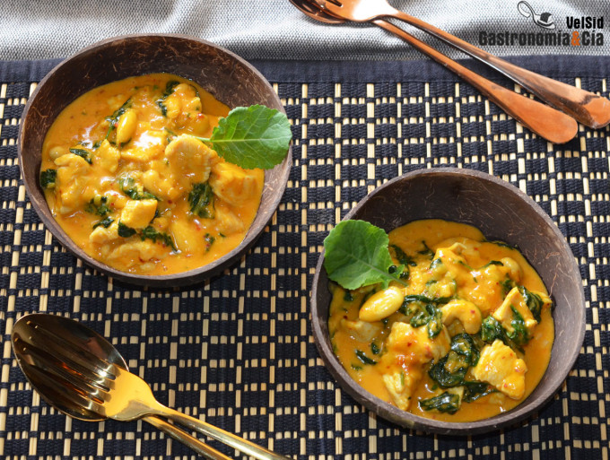

[title]: #()

## Pollo con salsa cremosa de coco, cúrcuma y brotes de kale

[url]:#()

[img]: #()

[recipe-time]: #()

PreviousDay: false

TotalTime: 60 min

CookingTime: 60 min

[ingredients-content]: #()

### Ingredientes (4 comensales)

   - 600 gramos de muslos de pollo deshuesados
   - 1 puerro
   - 1 diente de ajo
   - 400 gramos de leche de coco
   - 1 c/s de salsa de ostras
   - 50 gramos de almendras y anacardos al natural
   - ½ c/p de cúrcuma
   - ½ c/c de pimienta negra recién molida
   - ½ c/c de ñora molida (o de chile molido si se quiere picante)
   - ½ c/c de jengibre en polvo
   - c/n de sal
   - 100 gramos de brotes tiernos de kale
   - c/n de aceite de oliva virgen extra.

[content]: #()

Pollo con salsa cremosa de coco, cúrcuma y brotes de kale, una receta tan
rica como fácil de hacer y con la que sorprender

No es un curry exactamente, pero lo parece, y encantará a quienes les
gustan los platos especiados y con ese toque que aporta la leche de coco a
los guisos, que es delicioso, pero que no quieren comer picante porque no
les gusta o no les sienta muy bien. Probad esta receta de *Pollo con salsa
cremosa de coco, cúrcuma y brotes de kale*, es *una receta tan rica como
fácil de hacer y con la que sorprender* a los amigos o a la familia.

Para hacer esta receta elegimos muslos de pollo, pues al tener más grasa
que la pechuga, queda más jugoso, de todas formas, se puede hacer también
con pechuga de pollo e incluso con los contramuslos, elegid lo que más os
guste o lo que tengáis en la nevera. Los brotes de kale
<https://gastronomiaycia.republica.com/2016/09/30/como-cocinar-col-kale-12-recetas-que-te-engancharan/>
son
muy tiernos, no como la col kale, por lo que sucede como cuando cocinamos
las espinacas frescas, que con un poco de calor es suficiente. Esta receta
de *pollo con leche de coco, cúrcuma y kale* lleva también frutos secos,
combinamos *almendras y anacardos* al natural, además de textura y sabor,
aportan sus beneficios nutricionales. Todo importa, ¿verdad?

Elaboración

Corta el pollo en daditos o trocitos más pequeños que un bocado. Pela el
blanco de puerro y lávalo bien, córtalo por la mitad longitudinalmente y
después pica bien fino. Pela el diente de ajo y lamínalo.

Pon una cazuela a calentar con un poco de aceite de oliva virgen extra y
dora el pollo a fuego fuerte, añade sal al gusto. Una vez dorado, retíralo
y reserva, después se incorporará a la salsa. Añade un poco más de aceite
de oliva virgen extra si es necesario y baja el fuego, pocha el puerro y el
ajo, y cuando esté tierno, añade la leche de coco y la salsa de ostras.

Incorpora también los anacardos y las almendras, y a continuación las
especias, cúrcuma, pimienta negra, ñora y jengibre, añade también un poco
de sal. Cuando la leche de coco empiece a burbujear, baja el fuego a media
potencia y deja reducir ligeramente, moviendo a menudo.

Cuando le falten unos cinco minutos, reincorpora el pollo a la cazuela, y
cuando falte un minuto, añade los brotes tiernos de col kale, enseguida
perderán volumen y se integrarán en el guiso de pollo y su salsa.
Acabado y presentación

Sirve el *pollo con salsa cremosa de coco, cúrcuma y kale* recién hecho en
platos hondos o cuencos, y a disfrutar. ¡Buen provecho!
