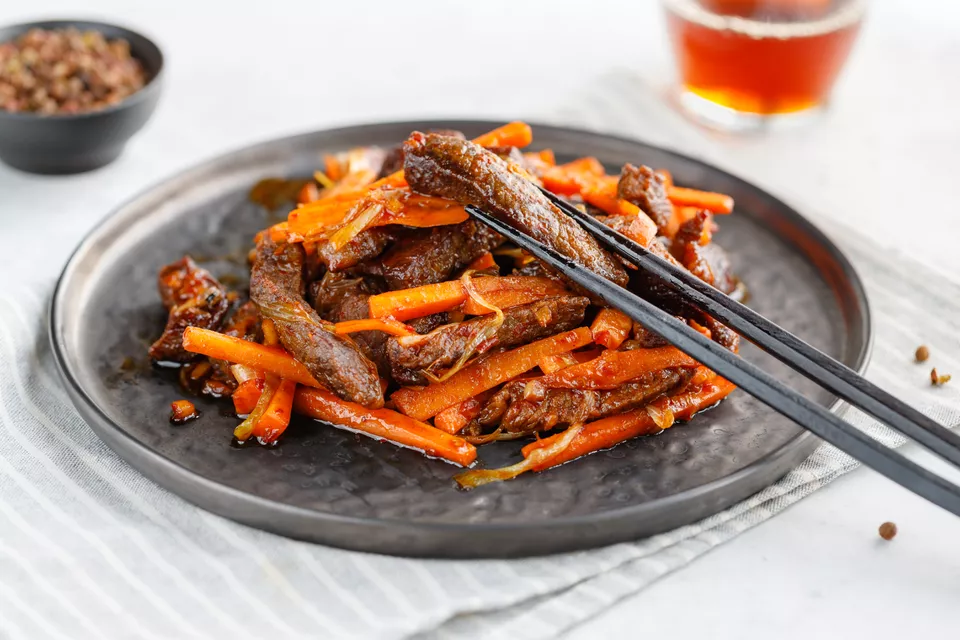

[title]: #()

## Szechuan Beef Recipe

[img]: #()

[#url]:#()

[recipe-time]: #()

PreviousDay: false

TotalTime: 30 min

CookingTime: 20 min

[ingredients-content]: #()

### Ingredients (3 servings)

   - 1 pound beef (flank or sirloin steak is good)
   - 2 medium carrots
   - 1 tablespoon minced ginger
   - 2 scallions (white parts only)
   - 1 tablespoon sweet bean sauce (or substitute hoisin sauce
   <https://www.thespruceeats.com/what-is-hoisin-sauce-3376814>)
   - 3 teaspoons chili paste (or chili sauce, as needed)
   - 7 1/2 tablespoons oil (for stir-frying)
   - 1/4 teaspoon salt
   - 1 tablespoon Chinese rice wine (or dry sherry)
   - 1/2 teaspoon sugar
   - 1/2 teaspoon roasted Szechuan peppercorns
   

[content]: #()

In this Szechuan recipe, the beef is dry fried, making it chewy and crispy.

If you like, you can replace one of the carrots with 1/2 cup of celery that
has been strung and cut julienne-style

Feel free to make the dish hotter by adding more chili paste or sauce if
desired.

Steps to Make It

   1. Gather the ingredients.
   
   2. Cut the beef julienne style, across the grain, into
   thin slices less than 1/4-inch thick and 2 1/2 to 3 inches long.
   3. Wash, peel, and julienne the carrots into thin strips about 1/8-inch
   thick and 2 1/2 to 3 inches long.
   4. Mince the ginger.
   5. Cut the scallion into lengths about 2 1/2 inches long, and then into
   thin shreds.
   6. In a small bowl, combine the bean sauce and chili paste or chili sauce.
   Set aside.
   7. Heat the wok on medium-high heat for at least 30 seconds. The wok is
   ready when you can feel the heat when holding the palm of your hand 2 to 3
   inches above the wok's surface.
   8. Add 1 1/2 tablespoons oil to the heated wok
   <https://www.thespruceeats.com/telling-a-wok-is-hot-enough-694410> by
   drizzling it down the sides. When the oil is hot, add the julienned
   carrots. Stir-fry for 2 minutes, stirring in the salt. (Do not brown the
   carrots.) Remove from the wok.
   9. Heat remaining 6 tablespoons of oil in the wok over medium-high to high
   heat. When the oil is hot, add the beef.
   10. Stir-fry <https://www.thespruceeats.com/tips-for-perfect-stir-fry-995435>
for
   approximately 10 minutes, until the beef is crispy and dark brown and chewy
   (you will hear the beef sizzle as it dries out).
   11. Splash the beef with the rice wine or dry sherry during the later stages
   of cooking.
   12. Push the beef up to the sides and drain all but 2 tablespoons from the
   wok. Add the bean sauce and chili paste or sauce mixture, and stir-fry for
   a few seconds.
   13. Then add the ginger and scallions. Stir-fry for a few seconds, until
   aromatic, then return the carrots to the wok.
   14. Stir in the sugar and the roasted Szechuan peppercorns. Taste and adjust
   seasonings if desired.
   15. Serve hot and enjoy!

Dry Frying Technique

In many Asian recipes, a technique known as dry frying is used. This means
to cook an item in a large amount of hot oil to dry out the interior
moisture to concentrate the flavor.

After the initial drying stage, the food item is briefly stir-fried with
other seasonings and ingredients. The dried item soaks up all the flavors
of the sauce to make a superior dish.

