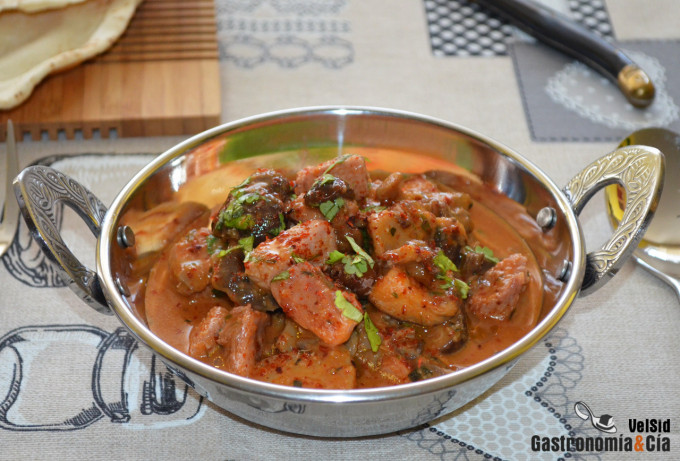

[title]: #()

## Curry rojo de pavo y setas, una receta para mojar pan

[img]: #()

[#url]:#()

[recipe-time]: #()

PreviousDay: false

TotalTime: 30 min

CookingTime: 30 min

[ingredients-content]: #()

Ingredientes (4 comensales)

   - 700 gramos de pavo deshuesado
   - 1 blanco de puerro
   - 2 dientes de ajo
   - 1 rodaja gruesa de jengibre fresco
   - 300 gramos de setas variadas
   - 1 c/p de pasta de curry rojo
   - 1 c/s de salsa de ostras
   - 400 gramos de leche de coco
   - 1 hoja de lima kaffir
   - 3 ramitas de cilantro fresco
   - c/n de sal
   - c/n de aceite de coco (o aceite de oliva virgen extra).

[content]: #()

Si quieres disfrutar de un sabroso plato como este Curry rojo de pavo y
setas, toma nota de la receta, porque además de rico, es muy fácil y rápido
de hacer, no necesitas más de media hora, por lo que podrás hacer este
curry con leche de coco cualquier día de la semana.

Nos gustan mucho los currys de todo tipo, así que es uno de los platos que
hacemos a menudo pero más que siguiendo recetas tradicionales de la cocina
asiática, guiándonos por nuestros gustos y por lo que tenemos en la nevera.
El resultado siempre es un plato muy sabroso, y la verdad, es que es muy
fácil y rápido de hacer, podéis comprobarlo con este *Curry rojo de pavo y
setas, una receta para mojar pan* ¡y para repetir!

Tomad nota de la receta paso a paso a continuación, y recordad que podéis
hacer las adaptaciones necesarias para que sea un plato a vuestro gusto,
por ejemplo, podéis cambiar la carne y hacerlo con pollo o solomillo de
cerdo, también podéis utilizar una sola variedad de setas, la que tengáis
en la nevera o la que más os guste, o añadir algunas verduras, como
pimiento, berenjena

Pero no dudéis que siguiendo esta *receta de curry* de *pavo y setas*al
dedillo, vais a disfrutar.

#### Elaboración

Pon una sartén grande a calentar con un poco de aceite de coco o de oliva
virgen extra, dora la carne de pavo cortada en dados a fuego fuerte y
retíralo de la sartén, reserva. En la misma sartén, si es necesario
añadiendo un poco más de aceite, pocha a fuego lento del puerro cortado en
juliana, cuando esté tierno añade el ajo laminado y el jengibre rallado,
sube un punto el fuego y deja que desprendan su sabor.

A continuación añade las setas que previamente habrás limpiado y cortado al
gusto, si no tienes setas frescas, puedes utilizar la mezcla de setas
congeladas. Saltea las setas hasta que se haya evaporado su agua y entonces
añade la pasta de curry rojo, fríelo e incorpora la salsa de ostras y la
leche de coco.

Mezcla con la espátula y añade la hoja de lima kaffir para
que deje su aroma en la salsa, después la retirarás. Reincorpora la carne
de pavo a la sartén para que se termine de cocinar, añade el cilantro
fresco picado y sal al gusto. Cocina a fuego medio alto hasta que la salsa
reduzca.

#### Acabado y presentación

Sirve el *curry de pavo y setas con leche de coco* en platos hondos o
cuencos, espolvorea un poco más de cilantro fresco si lo deseas, y acompaña
con un pan plano, como el pan pita, por ejemplo. ¡Buen provecho!
