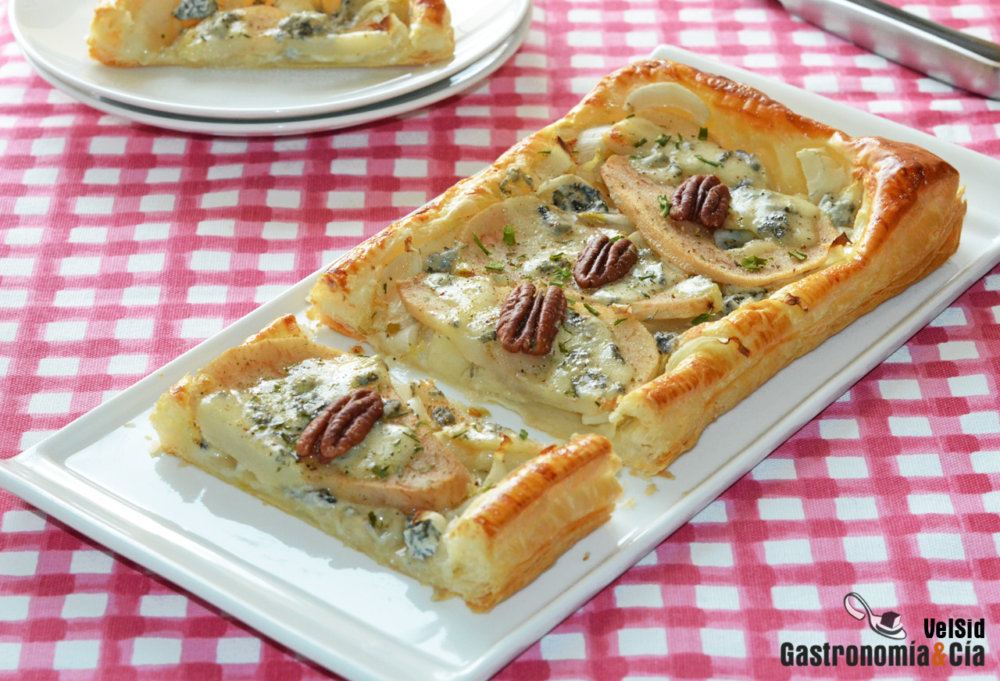

[title]: #()

## Hojaldre de endibias, pera y queso azul curado, una deliciosa tarta salada  para una comida especial

[img]: #()

[#url]:#()

[recipe-time]: #()

PreviousDay: false

TotalTime: 20 min

CookingTime: 15 min

[ingredients-content]: #()

Ingredientes (4 comensales)

   - 1 lámina de hojaldre fresco
   - 1 huevo
   - 2 endibias
   - 2 peras Conferencia
   - 80 gramos de queso Gorgonzola curado
   - c/n de nueces
   - c/n de pimienta negra recién molida
   - c/n de cebollino deshidratado (opcional).
   
[content]: #()

Hojaldre de endibias, pera y queso azul curado, una deliciosa tarta salada
para una comida especial

Os proponemos preparar esta receta de Hojaldre de endibias, pera y queso
azul curado porque es una deliciosa tarta salada para ofrecer en una comida
especial con amigos o familia, aunque también podéis hacer esta tarta para
dos, es muy fácil y rápida de hacer.

Este fin de semana teníamos que preparar un menú especial y parte de él ha
sido este *Hojaldre de endibias, pera y queso azul curado*, una
exquisita *tarta
salada* que ha encantado a nuestros invitados. Es una receta muy fácil de
hacer y también rápida, pero es imprescindible que las materias primas sean
las mejores a las que tengamos acceso. Elegir un buen hojaldre fresco nos
parece primordial, por lo demás, veréis que se necesitan pocos ingredientes
y muy accesibles.

Pues os dejamos con la receta del *Hojaldre de endibias, pera y queso azul
curado, una deliciosa tarta salada para una comida especial* y que, en este
caso hemos preparado con Gorgonzola, pero también podéis hacerlo con queso
Cabrales
u
otro queso azul que sea de vuestro agrado. Por cierto, os proponemos esta
receta de tarta salada como entrante, pero también podéis hacer raciones
más pequeñas para ofrecerla como aperitivo.

#### Elaboración

Corta la lámina de hojaldre en dos rectángulos, aunque también puedes hacer
la tarta entera o cortada en cuatro porciones, como prefieras. Casca el
huevo y bátelo, puedes añadir un chorrito de leche para aligerarlo. Pincha
el centro de la masa de hojaldre con un tenedor y pinta el borde con el
huevo batido.

Corta la base de las endibias y retira las hojas exteriores, lávalas y
escúrrelas bien, a continuación córtalas en juliana y ponlas sobre el
hojaldre, bien repartidas.

Pela las peras y córtalas en láminas longitudinales, retira las semillas de
la fruta y reserva las rodajas pequeñas para el postre. Coloca de forma
armónica las láminas de pera y sobre ellas distribuye el queso azul
troceado y las nueces.

Introduce la preparación en el horno precalentado a 200º C y hornea durante
15 minutos o hasta que el borde del hojaldre de endibias
esté
dorado. Entonces, retira la bandeja del horno y pasa la tarta salada a una
rejilla para que se enfríe y la base quede crujiente, y espolvorea la
pimienta recién molida y el cebollino deshidratado.
Acabado y presentación

Sirve la *tarta de hojaldre con pera, queso Gorgonzola y nueces* en los
platos cuando se haya enfriado, no necesita nada más para disfrutar de un
aperitivo o entrante exquisito. ¡Buen provecho!
