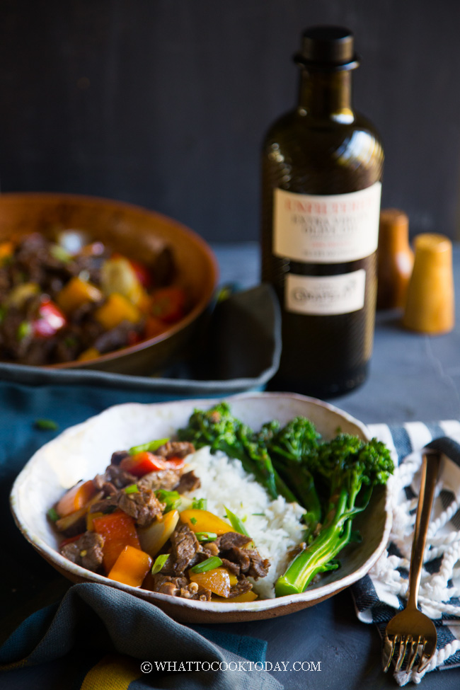

[title]: #()

## Chinese Five-Spice Sizzling Steak Stir-fry Rice Bowl

[img]: #()

[#url]:#()

[recipe-time]: #()

PreviousDay: false

TotalTime: 48 min

CookingTime: 15 min

[ingredients-content]: #()

### INGREDIENTS (4 Servings):

   - 1 lb skirt steak or flank steak
   - 3 Tbsp Carapelli Unfiltered Organic Extra Virgin Olive Oil divided
   - 2 Tbsp shaoxing wine or dry sherry

AROMATICS:

   - 1 tsp minced garlic
   - 1 tsp fresh ginger peel and grate

VEGETABLES:

   - 1 large onion
   - 2 cups bell peppers (mixture of red, green, yellow, or orange)
   - 8 oz baby broccoli

MARINADE:

   - 1 tsp cornstarch
   - 1/2 tsp Chinese five-spice powder
   - 1 Tbsp soy sauce
   - 1 Tbsp oyster sauce

SAUCE:

   - 2 Tbsp soy sauce
   - 1 Tbsp oyster sauce
   - 1 tsp sugar
   - 1 Tbsp water
   - 1 tsp cornstarch
   
[content]: #()

 Chinese Five-Spice Sizzling Steak Stir-fry Rice Bowl is made with thinly
sliced steak infused with aromatic Chinese five-spice powder and stir-fried
with a savory sauce. A quick, easy, and tasty meal for any day of the week.

One of the recipes that I like to make for our family on a weekly basis is
this Chinese five-spice sizzling steak stir-fry, which I can easily
assemble into rice bowls. I love stir-fries because they are convenient and
pretty much a complete meal of its own.

Before we get into the cooking part, you might have few questions such as:
WHAT’S THE BEST CUT OF BEEF TO USE FOR THIS SIZZLING STEAK STIR-FRY?

I like skirt steak or flank the best for stir-fry
WHAT KIND OF VEGGIES CAN I USE FOR THIS STIR-FRY?

Though I used multi-color bell peppers and baby broccoli in this stir-fry,
you can definitely venture out and use other greens like bok choy,
broccoli, snap peas, green beans. Just to mention a few!
HOW TO MAKE THE STEAK TENDER?

Freeze the steak briefly for about 15 minutes. This will help you to slice
thinly. It is also important to slice the steak across the grain. My mom
also swears that marinating meat, like beef with cornstarch, also helps to
tenderize the meat.

### TIPS

1. THINLY SLICE THE STEAK AND MARINATE
Place the steak in the freezer for about 15 minutes and then thinly slice
across the grain and then marinade for 30 minutes at room temperature while
you are preparing other things.
2. PREPARE THE VEGGIES
Cut the onions and bell peppers into large wedges. If you use baby
broccoli, you have the choice of either blanching them in boiling water,
then drizzling with Carapelli Extra Virgin Olive Oil and seasoning with a
bit of sea salt so that you can serve them with the rice bowl later. Or you
can include them in the stir fry after blanching.

3. PREHEAT THE WOK/SKILLET
You need ample heat to make a good stir-fry. A cold wok/skillet is
definitely a bad start. Make sure you preheat the wok/skillet until hot and
then add Carapelli Extra Virgin Olive Oil.

4. COOK THE STEAK FIRST
Add the thinly sliced and marinated steak, and let it cook undisturbed for
about 30 seconds and then stir fry briefly until no longer pink. Then dish
out to a serving platter.

5. COOK THE VEGGIES NEXT
All those brown bits left from cooking the steak are one of the key
ingredients to the amazing flavor. Don’t wash it off or scrape it off. Add
more Carapelli Extra Virgin Olive Oil and then stir fry the veggies.

6. DEGLAZE
Adding some liquid, in this case, the cooking wine, will deglaze the
wok/skillet and all those brown bits earlier will be loosened and impart
amazing flavor to your stir-fry. This is the time you want to scrape the
bottom of the wok/skillet.

7. EVERYTHING BACK TO THE WOK/SKILLET
Add the steak back to the wok/skillet and if you choose to, you can add the
baby broccoli into the wok/skillet too (or just serve them separately). Add
the sauce and continue to stir fry until the sauce thickens.

8. ASSEMBLE INTO RICE BOWLS
Portion the cooked rice into a bowl. Spoon the steak and veggies on the
side of the rice along with the sauce, or if you serve the baby broccoli
separately, arrange 2-3 stalks baby broccoli on the other side. Serve
immediately.

### INSTRUCTIONS:
#### MARINADE THE STEAK:

   1.   Place the steak in the freezer for about 15 minutes and then thinly
   slice across the grain
   2.   While the steak is in the freezer, place all the marinade ingredients
   and aromatics into a large bowl. Whisk to mix. Add the thinly sliced beef
   and marinade for 30 minutes at room temperature

#### PREPARE OTHER THINGS:

   1.   Veggies: While waiting for the steak to marinate, peel and cut the onion
   into large wedges. Seeded the bell peppers and cut into about 1-inch square
   2.   Bring a medium pot of water to a boil. Add baby broccoli and blanch for
   about 2 minutes and then quickly submerge in cold water to stop the cooking
   process. Remove and drain water off
   3.   Place baby broccoli on a plate. You can either leave it as is or drizzle
   with 1 Tbsp Carapelli Extra Virgin Olive Oil and freshly ground sea salt to
   serve with the rice bowl later or you can use include them in the stir-fry
   after blanching. Set aside
   4.   Sauce: whisk all the ingredients for sauce and set aside

#### COOKING:

   1.   Preheat a wok or large skillet over medium to high heat. When it's hot,
   add 1 Tbsp of Carapelli Extra Virgin Olive Oil. Add the steak and let it
   cook undisturbed for about 30 seconds and then stir to turn the beef and
   cook again for another 1 to 1 1/2 minutes or until no longer pink. Remove
   from the wok/skillet to a plate
   2.   In the same wok/skillet. Add another 1 Tbsp of Carapelli Extra Virgin
   Olive Oil. Add bell peppers and onion. Stir fry for about 2 minutes or
   until the veggies are soft but still slightly crunchy
   3.   Deglaze with Shaoxing wine or dry sherry. Scrape the bottom of the
   wok/skillet to remove any little bits that stuck at the bottom when you
   cook the steak earlier. This adds extra flavor to the overall dish
   4.   Add the steak and baby broccoli in (if you choose to not serve
   separately). Give the sauce one last stir to make sure the cornstarch
   doesn't settle at the bottom. Pour into the wok/skillet and continue to
   stir fry until the sauce thickens slightly. Remove from the heat

#### SERVING:

   1.   Portion cooked rice on a bowl. Spoon the steak and veggies on the side
   of the rice along with the sauce or if you serve the baby broccoli
   separately, arrange 2-3 stalks baby broccoli on the other side. Serve
   immediately

