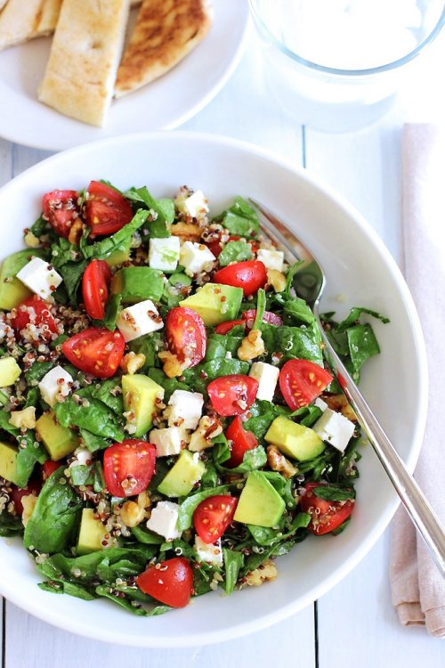

[title]: #()

## Ensalada de quinoa y aguacate

[img]: #()

[#url]:#()

[recipe-time]: #()

PreviousDay: false

TotalTime: 20 min

CookingTime: 20 min

[ingredients-content]: #()

### INGREDIENTES

Para la ensalada:

   - 1 taza y media de quinoa cocida (cocida según las instrucciones del
   paquete)
   - 1 aguacate cortado en cubos
   - 1taza y media de tomates cherry cortados en cuartos
   - 60 gr de queso feta en cubos
   - 4 tazas de espinacas frescas troceadas
   - 2 cucharadas de cebolla roja picada
   - 1/2 taza de nueces

Para el aderezo:

   - 4 cucharadas de aceite de oliva
   - 2 cucharadas de vinagre
   - 1/2 cucharadita de miel
   - 1/2 cucharadita mostaza de Dijon
   - 8 vueltas de pimienta negra molida
   - Una pizca de sal

[content]: #()

Esta ensalada de quinoa y aguacate es un plato perfecto para practicar
el Mindful
Eating. Está llena de proteínas
y fibra y tiene un sutil sabor a nuez. Además, todos sus ingredientes son
muy saludables: aguacate, tomates cherry, queso feta, espinacas, cebolla
roja y quinoa.

Todo se adereza con una vinagreta compuesta por aceite, vinagre, miel y
mostaza, creando una ensalada super fácil y muy sabrosa, ideal para un
caluroso día de verano.

Una de las cosas que me facilitan utilizar la quinoa en mi cocina, es tener
siempre a mano una taza de quinoa cocinada en la nevera. Así siempre lo
tienes cerca para añadirlo en las ensaladas.

Con el calor del verano en pleno apogeo, comer todos los días una ensalada
saludable es muy refrescante y recomendable, y esta es mi nueva favorita.
Así que, si estás buscando una ensalada colorida y saludable ¿por qué no le
das una oportunidad?

#### INSTRUCCIONES

Cocinamos la quinoa según las instrucciones del paquete. Dejamos que se
enfríe ligeramente una vez hecha y la reservamos mientras preparamos el
resto de ingredientes.

Lavamos y picamos las espinacas y las ponemos en un bol grande. Partimos el
aguacate por la mitad, le quitamos el hueso y sacamos la carne que
cortaremos en cubos y pondremos en el mismo bol de las espinacas.

Lavamos y picamos los tomates cherry en cuartos y los agregamos al bol.
Cortamos el queso feta en dados y lo incorporamos también, junto con la
cebolla picada.

Agregamos la quinoa cocida y las nueces y preparamos el aderezo. Para ello,
mezclamos el aceite de oliva, el vinagre, la miel, la mostaza, la pimienta
negra y la sal, hasta que esté emulsionado.

Vertemos el aderezo en los ingredientes y lo mezclamos todo bien. Servimos
a temperatura ambiente.
