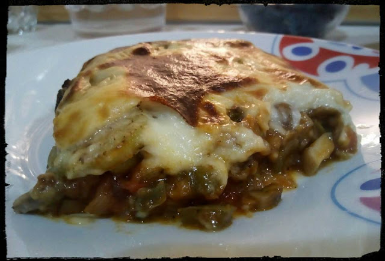

[title]: #()

## Mousaka de setas

[img]: #()

[#url]:#()

[recipe-time]: #()

PreviousDay: false

TotalTime: 1h30 min

CookingTime: 1h

[ingredients-content]: #()

### Ingredientes (4 personas)

* 3 dientes de ajos
* 2 cebollas frescas
* 1 pimiento verde XL
* 1 manojo de espárragos
* 2 tomates pera
* 300 gr setas portobello
* 1 cda de hierbas provenzales
* ½ vaso de vino blanco
* 1 cda de salsa de soja
* 2 patatas frescas
* 2 berenjenas medianas
* 2 cdas de harina
* 2 vasos de leche
* Sal y pimienta negra molida
* Nuez moscada
* 2 cdas de tomate frito
* Aceite de Oliva Virgen Extra

[content]: #()

Cortamos las berenjenas en rodajas finas y colocarlas en un bol con sal.
Dejar reposar al menos media hora. Mientras en una cazuela amplia salteamos
bien los ajos laminados, y las cebollas frescas picadas. Añadimos también
los pimientos picados y los espárragos verdes también troceados.
Salpimentamos y pochamos bien. Cuando la verdura esté ya medio hecho,
añadimos todas las setas picadas a la cazuela y seguimos pochando bien
todo. Dejamos así unos 20-25 minutos. Agregaremos entonces el vino blanco
(dejar un minuto que evapore el alcohol), la salsa de soja, los tomates
picados (no triturado) y un vaso de agua, ajustamos de sal. Esperamos que
rompa a hervir y bajamos el fuego, tapamos la cazuela y dejamos freír el
tomate bien durante unos 30 minutos. Mientras esto se va haciendo, secamos
las berenjenas y las pasamos por la plancha hasta dorar. Reservar. Por otro
lado cortamos las patatas a rodajas finas y las horneamos (o pasamos
por el microondas
8 minutos con papel secante) hasta conseguir que estén hechas y
doradas. Reservamos
también. Precalentamos el horno a 250º con grill. Pasamos a hacer la bechamel,
para ello echamos en un cazo 2 cucharadas de aceite de oliva y cuando
esté caliente
le añadimos 2 cucharadas colmadas de harina y removemos bien hasta que
se tueste
un poco, y seguidamente le vamos echando la bebida de soja poco a poco,
hasta conseguir una mezcla homogénea y ligeramente espesa. Salpimentamos y
añadimos nuez moscada, un poco mas de soja y reservamos. Para montar la
musaka colocaremos en la fuente de horno una capa de patatas, otra de
sofrito de verduras, encima una capa de berenjenas asadas y otra capa de
sofrito, mas otra de berenjenas, así hasta completar capas. Por último
coronamos la fuente con la bechamel y metemos al horno 5-10 minutos hasta
que la superficie este dorada. Dejamos reposar unos minutos fuera del horno
y servir.

... BUEN PROVECHO
