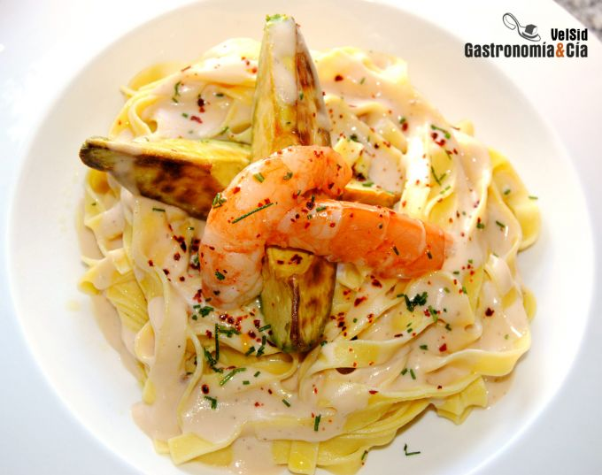

[title]: #()

## Tallarines con langostinos y aguacate a la plancha

[img]: #()

[#url]:#()

[recipe-time]: #()

PreviousDay: false

TotalTime: 40 min

CookingTime: 30 min

[ingredients-content]: #()

### Ingredientes (4 comensales)
    
- 400 gramos de tallarines frescos
- 12 langostinos grandes
- 1 aguacate
- ½ puerro (parte blanca)
- ½ cebolla
- 2 dientes de ajo
- 1 c/s de pimienta rosa
- ½ c/c de pimienta negra
- 60 gramos de whisky
- 20 gramos de Maizena
- 300 gramos de agua
- 275 gramos de leche
- cebollino
- pimienta aleppo
- aceite de oliva
- sal.

[content]: #()

Hoy tenemos una propuesta exquisita para disfrutar de un plato de pasta,
estos *Tallarines con langostinos y aguacate a la plancha*, pero cabe
destacar un matiz de este plato, el aguacate a la plancha. Seguramente
much@s de vosotr@s sabréis que el aguacate cambia completamente si se
cocina (no sucede igual en esta pizza
<https://gastronomiaycia.republica.com/2009/07/27/pizza-de-aguacate/> porque
el calor que recibe no es tan directo), aunque se marque superficialmente
en la parrilla y conserve su cremosidad en el interior, el sabor se hace
amargo.

Aunque a algunos nos pueda sorprender, a muchas personas les gusta, sobre
todo a quienes el aguacate fresco no les dice mucho, paladares que
disfrutan con sabores *bitters* seguro que agradecerán estos *Tallarines
con langostinos*. Nuestra recomendación es que antes de incluir el aguacate
en el plato, incluso antes de gastar un aguacate entero haciéndolo a la
plancha, es probar una porción y después valorar su inclusión en el plato.
Si no os gusta, sin ningún problema, elaborar esta misma *receta* y añadir
el aguacate crudo u omitirlo. La salsa de baña esta pasta está exquisita,
unos carnosos langostinos la hacen aún más rica, así que… ¡a la cocina!

### Elaboración

Pon un poco de aceite de oliva en una sauté o cazuela de paredes bajas,
pela y pica la cebolla y el puerro y póchalos a fuego lento añadiendo una
pizca de sal, pela y pica los ajos y cuando la cebolla y el puerro estén
transparentes, añádelos para que se doren un poco y dejen su sabor.

Retira estos ingredientes de la sauté y marca los langostinos en ella, sala
al gusto y hazlos vuelta y vuelta, para que la carne del langostino se haga
lo justo y ofrezca su mejor sabor, como sabemos, al cocer el marisco
conservando su caparazón
<https://gastronomiaycia.republica.com/2008/09/04/cocer-el-marisco-conservando-su-caparazon/>
 se concentran los sabores y aromas del mar. Retira los langostinos del
recipiente de cocción y cuando puedas manipularlos, pélalos, reserva la
carne en caliente y vuelve poner los caparazones en la sartén, a fuego
fuerte, baña con el whisky y deja se evapore.

A continuación añade el agua y lleva a ebullición, en ese momento baja el
fuego y deja cocer unos 15-20 minutos. Pasa el caldo por el colador chino
<https://gastronomiaycia.republica.com/2009/08/06/colador-chino/> presionando
bien las cabezas de los langostinos para que suelten todo su jugo.
Incorpora al caldo de langostinos la cebolla (y compañía) pochada, añade la
leche, reservando un poco para disolver la Maizena, y tritura.

Pon el caldo resultante en un cazo y llévalo a ebullición y cuando rompa a
hervir, incorpora la Maizena disuelta en leche. Deja cocer un minuto a
fuego lento batiendo con las varillas y reserva la salsa caliente.

En una olla con abundante agua y sal, cuece la pasta fresca el tiempo que
indique el fabricante. Después escúrrela y mézclala con la salsa. Por otro
lado, corta los aguacates en cuartos y éstos en mitades, pásalos por la
parrilla con un poco de aceite de oliva.

### Emplatado

Sirve los *tallarines con salsa de langostinos* y acompáñalos con dos gajos
de aguacate y tres langostinos. Termina con un poco de cebollino fresco
<https://gastronomiaycia.republica.com/2009/07/10/cebollino/> picado,
pimienta aleppo y sal es escamas. ¡Buen provecho!
