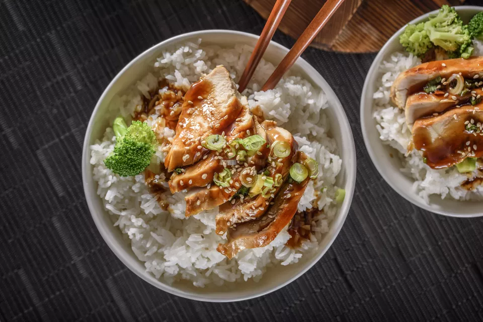

[title]: #()

## Cantonese steamed chicken

[img]: #()

[#url]:#()

[recipe-time]: #()

PreviousDay: false

TotalTime: 40 min

CookingTime: 25 min

[ingredients-content]: #()

### Ingredients 
   - 4-6 medium sized Chinese dried mushrooms (reserve 1 tablespoon soaking
   liquid)
   - 1 1/2 pounds assorted chicken pieces, bone-in. Cut into bit-sized pieces.
   - 1/4 teaspoon salt
   - Pepper, to taste
   - 1 1/2 tablespoons soy sauce (4 1/2 teaspoons)
   - 1 tablespoon Chinese rice wine or dry sherry
   - 1 teaspoon sugar
   - 1 teaspoon sesame oil
   - 1 1/2 tablespoons cornstarch
   - 2 slices ginger, shredded (about 1 tablespoon)
   - 1 green onion (spring onion, scallion), diced

[content]: #()

Cantonese steamed chicken is an easy, relatively quick dish to make.
Chinese dried black mushrooms add an earthy flavor to this recipe. It's a
great choice for family meals or even the occassional dinner party.

How to Make It

   1. Soak the dried mushrooms in a bowl of warm water for 20 minutes, or
   until they have softened. Squeeze out the excess water, cut the stems off
   the mushrooms, and thinly slice. Reserve 1 tablespoon of the mushroom
   soaking liquid.
   2. Use a heavy cleaver to chop the chicken through the bone into
   bite-sized pieces. Place in a heatproof bowl and add the salt, pepper, soy
   sauce, rice
   wine or sherry, sugar, sesame oil, reserved mushroom liquid and cornstarch.
   Allow to marinate while bringing water to a boil for steaming.
   1. Place the bowl on a rack in a pot for steaming or in a steamer such
   as a bamboo steamer in a wok. Place the chicken pieces in the middle of the
   plate and surround with the mushrooms. Sprinkle the shredded ginger and
   green onion over top. Steam the chicken over boiling water for 15 - 20
   minutes, making sure it is thoroughly cooked. Serve over rice.

