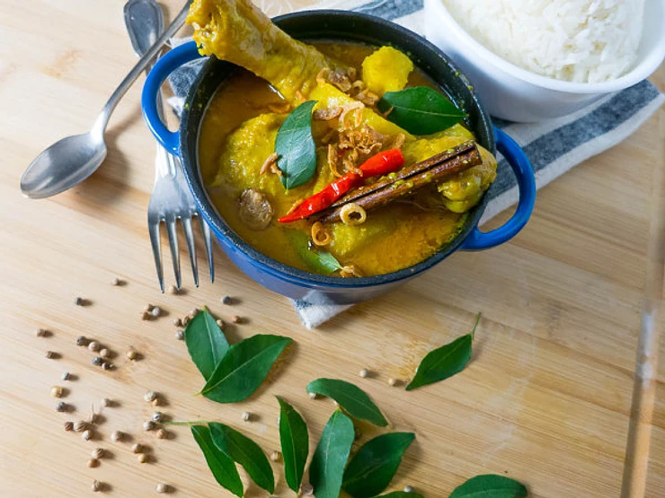

[title]: #()

## Malaysian curry

[img]: #()

[#url]:#()

[recipe-time]: #()

PreviousDay: false

TotalTime: 20 min

CookingTime: 20 min

[ingredients-content]: #()

### Ingredients

* 2lb Chicken Drumsticks, rinsed
* 10 Sprigs Curry Leaves
* 1 Stick Cinnamon
* 2 Cloves
* 1 Star Anise
* 2 Thai Red Chili, whole – *Optional*
* 2 Cups Coconut Milk
* 2 Teaspoon Salt, or to taste
* 1 Teaspoon Sugar
* 350 Grams Potatoes, peeled and chopped into chunks
* Fried Shallots – *Optional*

#### Spice Paste –* Rempah *(makes 350grams)
* 250 Grams Shallots or Red Onions, Roughly Chopped (regular onions can be substituted)
* 3 Garlic Cloves, Peeled and Roughly Chopped
* 20 Grams Belachan
* 25 Grams Turmeric Root, Peeled and Sliced
* 15 Dried Chili
* 3 Tablespoon Coriander seeds
* 1 Teaspoon Fennel Seeds
* 1 Teaspoon Cumin Seeds
* 2 Candle Nuts (macadamia nuts can be substituted) – *Optional*
* 1/3 Cup Grapeseed Oil

[content]: #()

I’ve never attempted to make curry from scratch, and I’m always looking for
new dishes to introduce to my blog. Especially easy and delicious recipes
that can be made after a long day of work. I decided on a Malaysian Nyonya
Curry Chicken. (Nyonya cooking is a result of blending Chinese ingredients
with various distinct spices used in the Malay community.)

This curry starts with a rempah, which is a combination of spices in a
paste form. To make the rempah, you can blend the ingredients with a mortar
and pestle which is quite time consuming, but the flavours and aromas are
more pronounced. But, I always reach for my food processor, just because it
works almost the same, but most importantly, it cuts the preparation time
down. Which is pretty important to me after work, cause I really just want
to get a good delicious meal on the table quicker so I can sit down and
relax.

After making this recipe, I decided to never use the store-bought paste
ever again. Not only does it taste better, but it is quite simple to put
together. Don’t be scared away by the list of ingredients either. It’s
actually quite easy to put together if you follow the below steps.
------------------------------
Recipe adapted from POH’S KITCHEN
<http://www.abc.net.au/tv/pohskitchen/stories/s2984186.htm>

SO WHAT YOU WILL NEED IS:

1. Remove the seeds from the Dried Chili’s. Cut them into smaller pieces,
and soak in water for 15 minutes.
2. To make the rempah: add all the rempah ingredients into the food
processor.
Hit the switch to on, and blend until everything together until a paste is
formed. This will take about 3 minutes.
3. In a saucepan, turn the heat to medium. Add rempah and saute for about
10 minutes. The paste will begin to thicken and darken, and the oils will
begin to separate the mixture a bit.
4. Add the curry leaves.
5. Next add the Cinnamon Stick, Cloves, Star Anise, and the *optional* Thai
Red Chili.
6. Add chicken pieces and stir-fry for 1 minute.
7. Add coconut milk, salt and sugar.
8. Add the potatoes. Bring to a boil, and then lower to a simmer. Cover and
simmer until chicken and potatoes are cooked through.
9. Serve with rice or roti canai.

