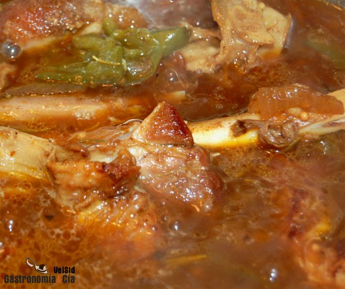

[title]: #()
## Fondo oscuro de cordero

[img]: #()

[#url]:#()

[recipe-time]: #()

PreviousDay: false

TotalTime: 2 h

CookingTime: 1h 40 min

[ingredients-content]: #()

### Ingredientes
* 1,5 kilos de cuello, pierna, *punta de cordero*o lo que tengas 
* 2 litros
de agua
* 1 cebolla
* 1 pimiento verde
* 3-4 dientes de ajo
* 200 mililitros de
coñac 
* 1 ramita de romero
* 1 c/c de mostaza en grano
* 1 c/c de comino
* 1 c/c de cúrcuma
* 1 c/c de pimentón (elegimos picante)
* pimienta negra
* aceite de oliva virgen extra
* sal.

[content]: #()

Hoy hemos querido hacer un Risotto de cordero para
lo que hemos necesitado elaborar un *fondo oscuro de cordero* previamente.
Cuando compramos cordero lo hacemos en grandes cantidades, según nos
apetezca hacemos costillas o chuletas a la brasa, o pierna y paletilla de
cordero al horno pero después nos quedan unas piezas que son ideales para hacer el *fondo
oscuro de cordero* u otras recetas de cordero.

Este fondo es una exquisitez para hacer un arroz, un guiso con patatas,
cuscús, bulgur u otras elaboraciones, y aunque este tipo de caldo admite
los ingredientes de acuerdo al paladar del comensal, os mostramos el que
hemos elaborado hoy.

Si quieres hacer otro tipo de *fondo o caldo*, iremos incorporando nuevas
elaboraciones, pero también puedes adelantarte y hacerlo a tu gusto, puede
servirte de ayuda leer el [post de Los Fondos](https://gastronomiaycia.republica.com/2008/04/03/las-salsas-fondos/).

### Elaboración

En una cazuela amplia con un poquito de aceite de oliva virgen extra, dora
el cordero salpimentado al gusto. Ve dándole vueltas para que se tueste
bien y suelte sus jugos. Llegado este punto incorpora la cebolla y el
pimiento verde cortados toscamente, y los ajos pelados y con un golpe de
cuchillo.

Rehoga unos minutos y riega con el coñac, mueve de vez en cuando y deja
cocer hasta que se consuma. A continuación incorpora el agua, depende de lo
fuerte que lo quieras puedes poner 2 o 2’5 litros de agua, y sazona con la
mostaza, el comino, la cúrcuma, el pimentón, la ramita de romero, pimienta
negra y sal al gusto.

Cuando entre en hervor, reduce el fuego al mínimo y deja cocer por un
espacio de una hora u hora y media. Espuma la superficie si fuera necesario
durante este proceso.

Cuando el fondo de cordero esté listo, puedes colarlo y desechar el resto
de ingredientes o retirar los huesos y triturar el caldo con la cebolla, el
pimiento, etc. Después sólo tienes que pasar el caldo por el colador chino
y obtendrás un delicioso *caldo de cordero* que dará un exquisito sabor al
plato que desees preparar.

