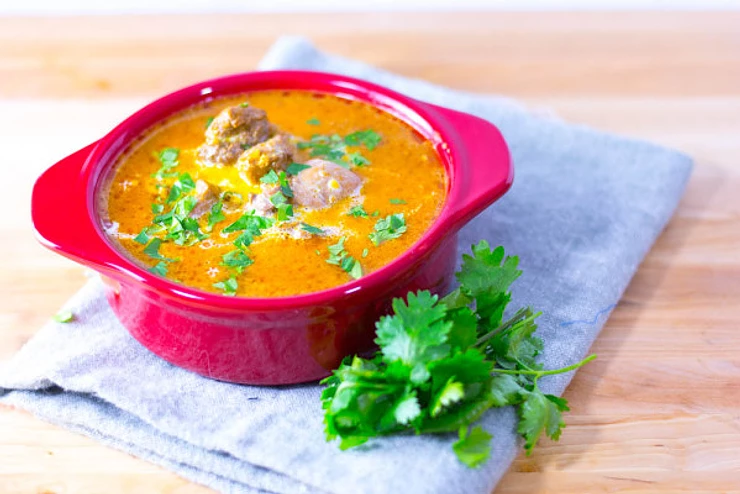

[title]: #()

## Butter chicken

[img]: #()

[#url]:#()

[recipe-time]: #()

PreviousDay: false

TotalTime: 2h

CookingTime: 40 min

[ingredients-content]: #()

### Ingredients (2 people)
Chicken Marinade:
* 1 lb chicken breast or thigh (cubes)
* 2 teaspoon lemon juice
* 1 tablespoon oil
* 1 teaspoon garam masala
* 1/4 teaspoon kosher salt
* 1/2 teaspoon turmeric
* 1/2 teaspoon cumin
* 1 teaspoon ground coriander
* 1/2 teaspoon kashmiri red chilli powder
* 1 teaspoon garlic, crushed
* 1 teaspoon ginger paste

Gravy:
* 1 tablespoon oil
* 2 tablespoon butter
* 1/2 cup onion, diced *(50 grams)*
* 1 teaspoon garam masala
* 1 teaspoon fenugreek powder
* 2 cloves
* 1 cinnamon stick
* 1 teaspoon crushed garlic
* 1 teaspoon ginger paste

* 3 large tomatoes, *(½ cup crushed canned tomatoes)*
* 1 teaspoon kashmiri red chilli powder
* 1/2 tablespoon sugar
* kosher salt and pepper to taste
* 1/2 tablespoon honey
* 80 ml heavy cream

Garnish:
* coriander leaves
* heavy cream

[content]: #()

Diwali is coming up on October 30th this year. I was figuring what recipe
to post to recognize this holiday, and I thought of Butter Chicken. Butter
Chicken is a hugely popular Indian dish. According to Wikipedia, KUNDAN LAL
GUJRAL, the owner of MOTI MAHAL DELUX, a restaurant in Delhi, is often credited as the
creator of butter chicken.

Typically, the dish starts with chicken marinaded with spices and a cream
mixture, next the chicken is traditionally cooked in a tandoor, then the
sauce is prepared and the chicken is added to the gravy that includes
butter. However, the recipe below differs in that the chicken will be
cooked on a pan in the gravy as opposed to in the tandoor.

SO WHAT IS DIWALI?

According to Wikipedia, Diwali, also known as Deepavali or the festival of
lights, is an ancient Hindu festival. This festival signifies the victory
of light over darkness or good over evil. The holiday is celebrated over 5
days. This holiday is one of the most important and largest holidays in
India, with bright lights, delicious foods, and festive clothing to
celebrate with family.

WHERE TO BUY THE SPICES?

The spices are easily found in Vancouver BC. I purchased my spices from
Whole Foods Market, but they can also be found at any other grocery market
such as Save-On-Foods or Superstore.

Garam Masala – is a blend of spices that includes: Black and white
peppercorns, cloves, cinnamon or cassia bark, mace (nutmeg), black and
green cardamom pods, bay leaf, and cumin

Turmeric – is a deep-orange-yellow powder made from dried rhizomes (*of the
ginger family*).

Cumin – is a dried seed and a member of the parsley family. It adds a
earthy and warmness to food.

Coriander seeds – are the seeds of cilantro or Chinese parsley.

Kashmiri red chilli powder – the dark orange colour in butter chicken comes
from adding kashmiri red chili powder. It adds a bit of heat but imparts a
beautiful colour to the sauce. If you cannot locate this, feel free to
substitute with Hungarian paprika or a mixture of paprika and cayenne
(ratio of 3:1).

Fenugreek powder – Is made from a popular Indian seed. The seed is small,
hard, mustard yellow but has a tangy, bitter, burnt-sugar flavour.

1. Puree the tomatoes if you plan to use fresh tomatoes, if not skip this
step.
2. Cut the chicken into bite-sized bits.
3. Marinade the chicken with the lemon juice, oil, garam masala, turmeric,
cumin, ground coriander, salt, kashmiri red chilli powder, crushed garlic,
and ginger paste for a minimum of 1 hour.
4. In a large pan on medium heat, add oil and butter until the butter is
melted.
5. Add the onions, garam masala, fenugreek powder, cloves and cinnamon
stick. Saute for 5 minutes until onions are caramelized.
6. Add garlic and ginger and fry for another 2 minutes.
7. Add the marinaded chicken. Stir and fry until it is no longer pink on
the outside.
8. Add pureed tomatoes, kashmiri red chilli powder, sugar, and salt and
pepper.
9. Increase the heat to medium-high to boil. Once it boils, reduce to low
heat and allow to simmer for 15 minutes with the lid on. Stirring
occasionally.
10. Remove and discard cinnamon stick and cloves. Turn off the heat and
cool for 10 minutes.
11. Pour in heavy cream and the honey. Stir to combine.
12. Plate the butter chicken and garnish with coriander leaves. I drizzled
the extra heavy cream on top.
