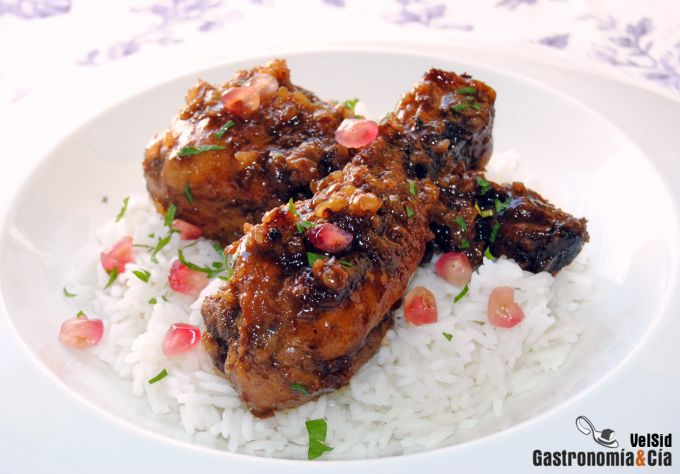

[title]: #()

## Pollo fejesan

[img]: #()

[#url]:#()

[recipe-time]: #()

PreviousDay: false

TotalTime: 1h

CookingTime: 40 min

[ingredients-content]: #()

### Ingredientes (4 comensales)

* Aceite de oliva virgen extra (también se suele hacer con mantequilla)
* 8 muslos de pollo
* 1 cebolla morada
* 3 dientes de ajo
* 1/2 c/p de canela en
polvo
* 4 vainas de cardamomo
* pimienta negra
* 100 gramos de nueces
* 220 gramos de caldo de ave (o agua) 
* 100 gramos de melaza de granada
* 50 gramos de miel
* sal
* granos de granada para decorar.

Para acompañar

* Arroz pilaf.

[content]: #()

Hoy tenemos una receta de la cocina persa muy recomendable para disfrutar
en estos meses, pues uno de sus ingredientes es la granada, bueno, la
melaza de granada, un jarabe que se elabora con el zumo que podemos obtener
de esta fruta y azúcar. La *receta de Pollo Fesenjan* la mencionamos en el
post en el que os explicábamos cómo hacer [melaza de granada](https://gastronomiaycia.republica.com/2009/10/08/melaza-de-granada/), en
realidad es un guiso que se puede hacer con pollo y con otras carnes, como
el pato, el cordero, la ternera…

Según [Wikipedia](http://en.wikipedia.org/wiki/Fesenj%C4%81n), se denomina
Khoresh-e fesenjān (idioma persa خورشت فسنجان) o *Fesenjān* (idioma persa:
فسنجان al estofado elaborado con el zumo de granada que os comentamos, y
nueces molidas. Se aromatiza con canela y opcionalmente con otras especias,
como la pimienta, el cardamomo… Hoy os mostramos cómo elaboramos el
*pollo* fesenjan,
hemos elegido los muslos de pollo, pero también se puede hacer con pollo
deshuesado, y como comentábamos, con otras carnes, incluso se puede hacer
con carne picada. El resultado es realmente exquisito, las nueces
trituradas con el resto de ingredientes conforman una salsa para chuparse
los dedos.

Elaboración

Pon una cazuela amplia con un fondo de aceite de
oliva virgen extra a calentar. Retira la piel del pollo antes de cocinar.
Dora los muslos en el aceite caliente dándole la vuelta para que se haga de
forma homogénea, entonces retíralo.

Reduce la temperatura del fuego e incorpora la cebolla picada, póchala a
fuego lento hasta que esté transparente, entonces añade los ajos pelados y
picados previamente, deja un par de minutos. Mientras tanto, tritura las
nueces en el accesorio de la batidora de mano o en una procesadora similar,
personalmente nos gusta que las nueces no queden muy finas, encontrar
algunos trocitos en la salsa.

Cuando los ajos empiecen a tomar color, incorpora las vainas de cardamomo
dándoles un golpe para que se abran, la canela y pimienta negra al gusto,
mezcla y al instante incorpora las nueces, rehógalas unos minutos y a
continuación añade el caldo o el agua, y sal al gusto. Sube el fuego e
incorpora la melaza de granada y la miel.

Cuando rompa a hervir, reduce el fuego, cuece con la cazuela tapada (sin
encajar) unos 25-30 minutos, ve dándole la vuelta al pollo de vez en
cuando, y comprobando que no se quede seco (se podría añadir un poco más de
caldo en caso necesario).
Emplatado

Este guiso de *pollo
con
nueces y granada* se puede servir con arroz pilaf, puedes ponerlo como base
del plato para que recoja la salsa. Presenta el pollo y reparte la salsa,
termina decorando con unos granos de granada que además de frescor,
aportarán color. De forma opcional puedes añadir un poco de perejil picado.
¡Buen provecho!
