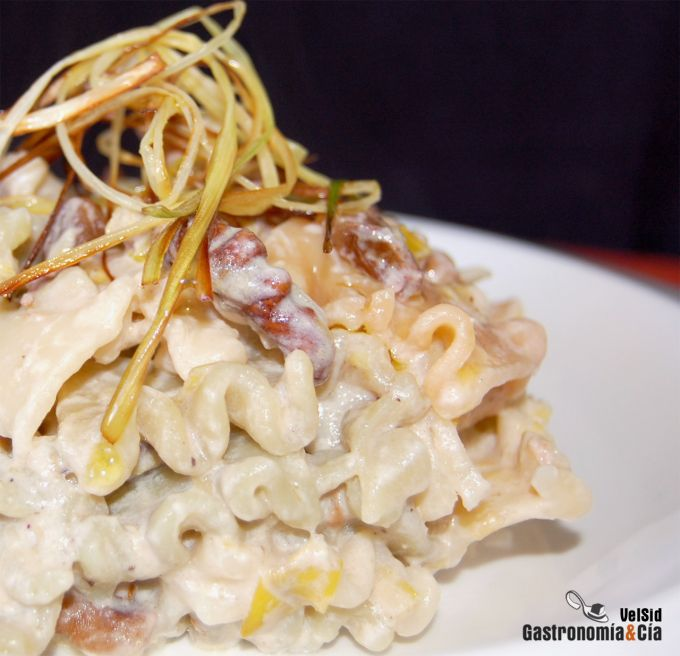

[title]: #()

## Pasta con salsa de puerro y lima

[img]: #()

[#url]:#()

[recipe-time]: #()

PreviousDay: false

TotalTime: 30 min

CookingTime: 20 min

[ingredients-content]: #()

### Ingredientes (4 comensales)
    
* 380 gramos de pasta
* 1 puerro
* 65 gramos de nueces
* 40 gramos de pasas
* 1
lima
* 200 ml. de nata para cocinar
* 100 ml. de leche
* 60 gramos de queso
curado (hemos utilizado un queso de leche cruda de oveja, puedes utilizar
otro más suave)
* pimienta de Jamaica
<https://gastronomiaycia.republica.com/2008/03/20/pimienta-de-jamaica/>
* pimienta
negra
* 1 c/c de azúcar
* aceite de oliva virgen extra
* sal ahumada
* sal
normal.

[content]: #()

La *Pasta con salsa de puerro y lima* es un capricho para el paladar,
juegan sabores dulces y ácidos, texturas cremosas y tersas, aromas cítricos
y lácticos, hay equilibrio, y el plato invita a repetir. Esta receta es
ideal para utilizar una pasta plana y acanalada, o mejor, recordad el
post Tipos
de pasta y la salsa adecuada
<https://gastronomiaycia.republica.com/2008/04/07/tipos-de-pasta-y-la-salsa-adecuada/>
.

Esta *receta* de *pasta con salsa* es fácil y rápida de hacer, por lo que
es una buena elección para un día normal y también para sorprender a esos
amigos amantes de la pasta en una cena informal.

### Elaboración

Retira las hojas externas y los extremos verdes del puerro, córtalo por la
mitad y lávalo, sécalo bien y pícalo no muy fino, reservando un poco para
cortarlo en juliana. Esta juliana fríela en aceite de oliva hasta que
empiece a estar crujiente, retira de la sartén y reserva sobre papel de
cocina absorbente.

Pon una olla con abundante agua para cocer la pasta, cuando rompa a hervir,
añade sal al gusto e incorpora la pasta, cuece hasta que esté al dente, el
tiempo que te indique el paquete o según el tamaño y grosor que tenga la
pasta. Después escúrrela, refréscala con agua fría y reserva.

Pocha el puerro en una sartén o cazuela amplia con aceite de oliva a fuego
medio-bajo, salpimenta al gusto e incorpora también el azúcar. Cuando
empiece a caramelizar incorpora las pasas y las nueces, sofríe un par de
minutos y añade la nata, la leche, pimienta negra, pimienta de Jamaica y
sal ahumada. Cuando la salsa empiece a espesar, añade la piel de la lima
rallada y su jugo, mezcla bien hasta que quede una crema homogénea.

Agrega entonces el queso troceado y mezcla bien hasta que se funda,
incorpora finalmente la pasta, mezcla y deja que ésta tome otra vez
temperatura.
