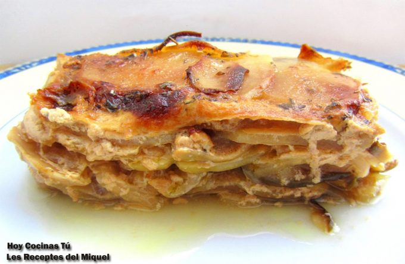

[title]: #()

## Pastel de patata y boletus

[img]: #()

[#url]:#()

[recipe-time]: #()

PreviousDay: false

TotalTime: 3 h

CookingTime: 2 h

[ingredients-content]: #()

### Ingredientes (4-6 comensales)
    
* 1 kilo de patatas
* 1/2 kilo de boletus edulis
* 2 cebollas grandes
* 400 ml.
    de leche evaporada
* 100 gramos de queso parmesano
* romero
* tomillo
* pimienta
    
* sal, aceite de oliva virgen extra.

[content]: #()

Con los pasteles de patata sucede lo que a muchos nos gusta, se pueden
hacer múltiples variantes, siendo además un posible entrante o una
guarnición sorprendente para el comensal cada vez que se prepara
simplemente haciendo pequeñas modificaciones. En vuestra sección de
recetas *Hoy
Cocinas Tú* tenemos una receta de *pastel de patata* que comparte con todos
nosotros Miquel, autor del blog Les Receptes del Miquel,
es muy fácil de hacer, así que si queréis tomar nota, preparad lápiz y
papel, serán pocos los ingredientes que necesitaréis.

Se trata de un *Pastel de patata y boletus*, además lleva una buena dosis
de cebolla bien pochada, que ofrecerá un contraste dulzón, y queso
parmesano rallado, que junto a las setas, aportará sabrosidad. Y como os
comentábamos, esta receta se puede variar y adaptar a los gustos y
necesidades de cada uno, podéis sustituir los boletus por otra setas,
añadir alguna hortaliza picada, o unos daditos de jamón o panceta… Si os
animáis a hacer un pastel de patatas, esperamos que lo disfrutéis, y si es
alguna variante, que la compartáis con nosotros.

### Elaboración

Cortar la cebolla en juliana y pocharla a fuego lento, con una pizca de
sal, y tapada durante unos 45 minutos. Mientras tanto, cortar la base del
pie de los boletus edulis, limpiarlos con un trapo húmedo y filetearlos.

En una sartén con un poco de aceite de oliva virgen extra, saltear las
setas, y cuando se doren un poco, retirar.
Cortar el extremo del tronco de los hongos. Limpiar con un trapo húmedo y
filetearlos. Saltear

Pelar las patatas y cortarlas en rodajas finas con la ayuda de la
mandolina, con un grosor de entre 1 y 1’5 mm. Engrasar el fondo de una
bandeja de horno adecuada para hacer el pastel con un poco de aceite de
oliva virgen extra y colocar una capa de patatas, seguida de una capa de
boletus, a continuación otra de cebolla, y finalmente una capa de queso
rallado, y repetir de nuevo con una capa de cada.

Condimentar con las hierbas aromáticas, pimienta y sal entre las capas.
Verter la [leche evaporada](https://gastronomiaycia.republica.com/2008/05/15/leche-evaporada/) e
introducir la bandeja en el horno precalentado a 180º C. Hornear entre 60 y
90 minutos. Finalizado el tiempo, dejar reposar un rato.
Acabado y presentación

Cortar el *pastel de patatas y setas* en porciones y servir en los platos.
