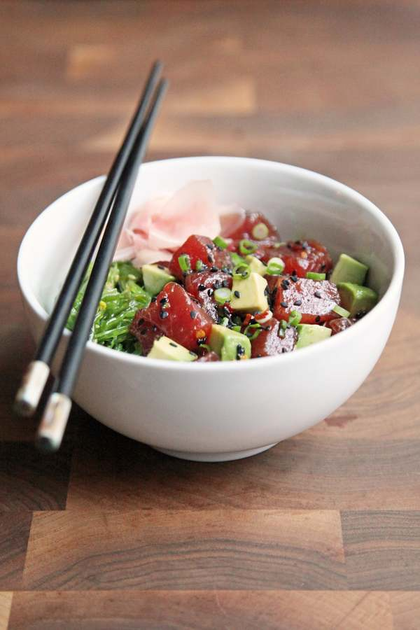

[title]: #()

## Tuna bowl

[img]: #()

[#url]:#()

[recipe-time]: #()

PreviousDay: false

TotalTime: 30 min

CookingTime: 25 min

[ingredients-content]: #()

### INGREDIENTS
    
1. 2 tablespoons soy sauce
2. 1 teaspoon rice wine vinegar
3. 1 teaspoon toasted sesame oil
4. 1 teaspoon sesame seeds, plus more for garnish
5. 1/2 teaspoon red pepper flakes
6. 1 pound sushi-grade ahi tuna, cubed
7. 2-3 scallions, thinly sliced
8. 1 avocado

*For serving*:
2. Cooked brown rice, at room temperature
3. Seaweed salad, optional
4. Pickled ginger, optional

[content]: #()

Cut the tuna and avocado into bite-size pieces (roughly 3/4-inch). Many
grocery store sushi counters sell seaweed salad; if you can't find it, it's
not essential to the dish. Sushi-grade salmon can be substituted for the
tuna, if you prefer a milder fish.

### DIRECTIONS

   1. Whisk together the soy sauce, vinegar, sesame oil and seeds, and red
   pepper flakes in a medium mixing bowl. Add the cubed tuna and scallions,
   gently stir together to dress the tuna. Marinade for 5 minutes.
   2. Meanwhile, pit and cube the avocado (the chunks should be of a
   similar size to the tuna. Add to the tuna, and gently mix together to
   distribute the avocado.
   3. To serve, scoop rice into bowls, top with tuna poke, seaweed salad,
   and a few pieces of pickled ginger.
