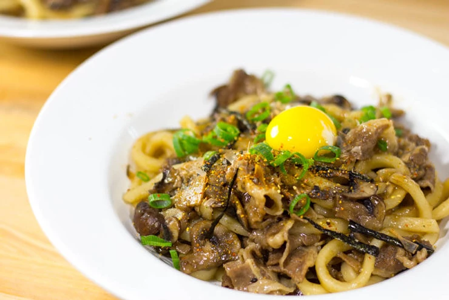

[title]: #()

## Beef Yakiudon 

[img]: #()

[#url]:#()

[recipe-time]: #()

PreviousDay: false

TotalTime: 25

CookingTime: 10

[ingredients-content]: #()

### Ingredients
* 2 blocks of frozen sanuki udon
* 2 teaspoon sesame oil
* 2 tablespoon unsalted butter
* 1 clove garlic, crushed
* 1 shallot, sliced *(alternatively, you can use a quarter of a small onion)*
* 150 grams of sliced beef
* 125 grams Mushrooms, sliced *(any type, I prefer shiitake and shimeji but couldn’t locate those in the grocery store today)*
* 25 ml soy sauce
* 1 tablespoon oyster sauce
* 2 teaspoon mirin
* 1 teaspoon Japanese Worcestershire sauce *(optional)*

* 1/4 cup dashi stock

Garnish suggestions:
* Dash Shichimi Togarashi *(Japanese 7 spice)*
* 1 Green onion stalk, sliced
* 1 tablespoon Bonito flakes
* Nori strips
* Egg Yolk

[content]: #()

1. In a medium saucepan, bring to boil water on high heat.
2. Once the water starts boiling, add the frozen udon to cook for about 2
minutes.
3. Strain the water well through a wire strainer and set aside.
4. In a skillet or wok, heat the sesame oil and butter until melted on
medium heat.
5. Next, add the onions and garlic. Stir and fry for about a minute.
6. Add the sliced mushrooms and cook for about 3 minutes.
7. Add the beef and cook until it is no longer pink.
8. Add the udon to the skillet or wok.
9. Add the soy sauce, oyster sauce, mirin, and Worcestershire sauce.
10. Stir and fry everything together for about 30 seconds.
11. Next add the dashi stock, and mix everything together. If preferred,
add more dashi stock or butter to loosen the noodles.
12. After stir-frying for a minute the dish is complete.
13. Plate the noodles and top with your preferred garnishes. *I like to
plate mine with all the garnishes, since I have*
