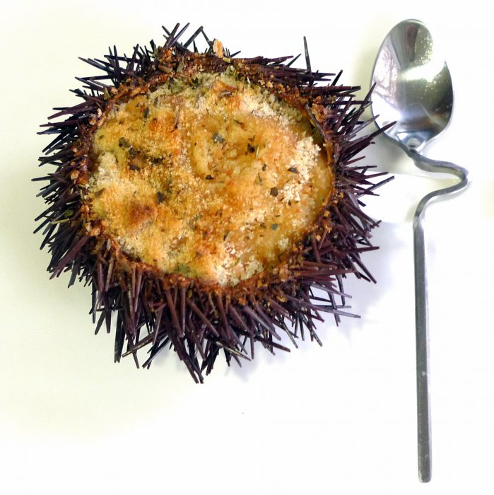

[title]: #()

## Erizos de mar rellenos

[img]: #()

[#url]:#()

[recipe-time]: #()

PreviousDay: false

TotalTime: 40 min

CookingTime: 40 min

[ingredients-content]: #()

### Ingredientes Erizos de mar rellenos para 4 personas:
    
- 8 erizos de mar
- 1 Cebolleta
- 2 Cucharadas de Brandy o Coñac
- 250 ml de leche entera
- 1 Cucharada de harina de maíz
- Sal
- Aceite de oliva
- Pan rallado
- Mantequilla

[content]: #()

Este fin de semana hemos degustado unos deliciosos Erizos de mar rellenos
como aperitivo…

Después de mostraros que son los* erizos de mar*, además de ver que fácil y
sencillo es su limpieza, os mostramos la primera de las recetas que hemos elaborado con los oricios o
erizos de mar.

Los* erizos de mar rellenos *es una receta muy sencilla que otorga al comensal un
bocado con pleno sabor a mar.

Si bien la carne de erizo se puede emplear de múltiples maneras en la
cocina, con los* erizos rellenos *hemos conseguido dos cosas, un plato
vistoso y muy sabroso.

Elaboración Erizos de mar rellenos:

   1. Después de limpiar los  erizos de mar, pochamos en una sartén con dos
   cucharadas de aceite de oliva la
   cebolleta cortada finamente.
   2. Cuando veamos que está casi transparente, añadimos la carne y un poco del jugo de los erizos.
   3. Removemos, dejamos que se evapore un poco el caldo e incorporamos el
   coñac.
   4. Flambeamos o dejamos que se evapore el alcohol.
   5. Echamos la cucharada de harina de maíz, y doramos un minuto.
   6. Incorporamos la leche y, con la
   ayuda de unas varillas, elaboramos una bechamel espesa.
   7. Rectificamos el punto de sal, retiramos y rellenamos los caparazones
   de los erizos.
   8. Cubrimos con una cucharada de pan rallado, unos dados de mantequilla
   y hierbas provenzales.
   9. Gratinamos unos minutos en el horno.

Sacamos y degustamos nuestros erizos de mar rellenos con una buena copa de vino
blanco.
