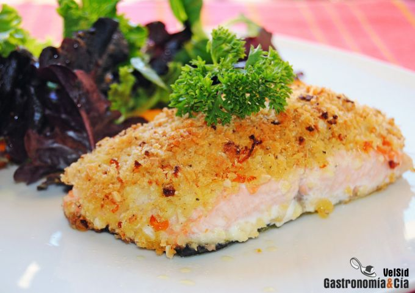

[title]: #()

## Salmón horno con almendras

[img]: #()

[#url]:#()

[recipe-time]: #()

PreviousDay: false

TotalTime: 30 min

CookingTime: 15 min

[ingredients-content]: #()

### Ingredientes (4 comensales)
    
* 4 lomos de salmón fresco
* 40 gramos de panko (o miga de pan seca y
    desmenuzada)
* 15 gramos de queso parmesano recién rallado
* 1 gramo de piel
    de naranja rallada (hemos utilizado de naranja sanguina y
    normal
* aproximadamente 1 c/p colmada)
* 15 gramos de almendra picada
* 1/2
    cebolla tierna
* pimienta negra recién molida
* jengibre en polvo
* 50 gramos
    de aceite de oliva virgen extra.

[content]: #()

Decididamente, esta *receta* de *Salmón al horno* será próximamente la que
incluiremos en un menú de celebración para sorprender a nuestros
comensales, es una elaboración sencilla, cómoda y que ofrece un resultado
excelente. No es el primer pescado en costra que preparamos, recordad
el Merluza
al horno en costra de almendra,
pero con el salmón tenemos más costumbre de hacerlo a la plancha o a la
parrilla, nos encanta tostar la superficie y conservar un interior jugoso,
la combinación de texturas y sabores de una misma pieza en un bocado, nos
encanta.

Pero desde que vimos esta receta en Pinterest, la tomamos como
inspiración para hacer nuestra versión, el resultado fue este *Salmón al
horno con costra de naranja y parmesano*. No dudéis en probarlo cuanto
antes, como siempre os decimos, eso os permitirá disfrutarlo más veces.

### Elaboración

Precalienta el horno a 210º C con calor arriba y abajo. Prepara la bandeja
del horno, cúbrela con papel de aluminio, papel vegetal o teflón, y pincela
con un poco de aceite de oliva virgen extra.

Pon en un cuenco el panko, el queso recién rallado, la piel de naranja
(puedes utilizar piel seca si tienes, o recién rallada), la almendra picada
y la cebolla tierna, previamente pelada y cortada en brunoise.

Añade el jengibre en polvo, cantidad al gusto, y la pimienta negra, mezcla
bien con una cuchara y a continuación añade el aceite de oliva. Vuelve a
mezclar para conseguir una preparación que con la presión se una, pero no
que esté encharcada en aceite, puedes verterlo poco a poco para asegurarte
de ello, pues según la miga de pan que utilices puedes necesitar menos
cantidad de aceite.

Limpia bien los lomos de salmón, asegúrate de que no tenga espinas y
sécalos bien con papel absorbente de cocina. Colócalos en la bandeja del
horno y cúbrelos cuidadosamente con la preparación que formará la costra
crujiente después del horneado. Presiona ligeramente para que se adhiera
bien.

Cuando el horno esté a la temperatura indicada, introduce la bandeja con el
pescado a altura media y hornea durante 15 minutos aproximadamente, todo
dependerá de lo gruesos que sean los lomos y del gusto del comensal, si te
gusta el salmón poco hecho o muy hecho. Será fácil comprobar el punto de
cocción.
Emplatado

Prepara una ensalada variada para acompañar el *Salmón al horno* con *costra
de naranja* y *parmesano*, sirve el pescado recién salido del horno, con la
corteza dorada y crujiente, muy sabrosa y jugosa, a la par que el salmón.
Un plato principal delicioso que seguramente repetirás. ¡Buen provecho!
