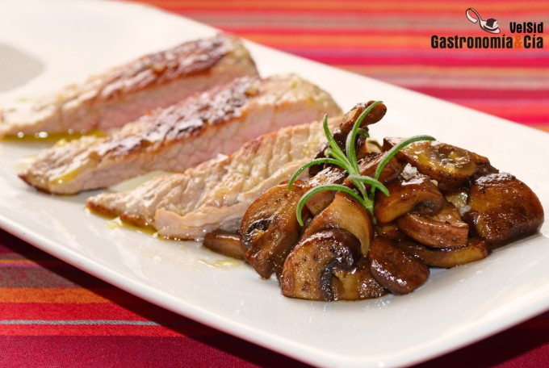

[title]: #()

## Estofado de champiñones Portobello al vermú

[img]: #()

[#url]:#()

[recipe-time]: #()

PreviousDay: false

TotalTime: 30 min

CookingTime: 30 min

[ingredients-content]: #()

### Ingredientes (4 comensales)
    
* 600-700 gramos de secreto de cerdo
* 1 chalota
* 1 diente de ajo
* 450 gramos
de setas Portobello
* 200
gramos de vermú negro
* 1 ramita de romero
* c/n de pimienta negra recién
molida
* 4 c/s de mahonesa
* 4 dientes de ajos asados
* c/n de sal fina
* c/n
de sal Maldon
* c/n de aceite de oliva virgen extra.

[content]: #()

Os traemos una guarnición para una carne a la parrilla o a la plancha que
os va a gustar, es un *estofado de champiñones Portobello al vermú* que en
esta ocasión servimos con *secreto de cerdo*. Es una receta muy fácil de
hacer, y por supuesto, está deliciosa. Otra prueba de que para disfrutar de
la comida casera no hace falta pasar horas en la cocina.

El *Secreto de cerdo con estofado de setas al vermú* conquistará a los
amantes de esta jugosa carne y a quien disfruta del toque dulzón para
combinar, pues éste lo aporta el vermú con el que se guisan las setas.
Claro, lo ideal es elegir un buen vermú porque sucede como con el vino,
sólo se puede cocinar con él si también te lo beberías. Tomad nota de la
elaboración paso a paso a continuación.

Prepara la carne para hacerla a la parrilla o a la plancha, retírale el
exceso de grasa de la superficie. Pela la chalota y el ajo y pícalos finos,
limpia los champiñones Portobello y córtalos en cuartos o más pequeños, al
gusto.

### Elaboración

Pon una sartén amplia a calentar con un poco de aceite de oliva virgen
extra y cuando esté caliente incorpora la chalota y el ajo, deja que tomen
un poco de color y añade las setas, salpimenta al gusto y saltea un par de
minutos. A continuación moja con el vermú y añade la ramita de romero, tapa
la sartén (sin encajarla) y cocina unos diez minutos.
Comprueba que las setas están a tu gusto, rectifica de sal y pimienta si es
necesario, y si queda mucho jugo en la sartén, sube el fuego y destapa para
que reduzca.

Mientras se hacen las setas haz el secreto de cerdo en la parrilla o
sartén, dorándolo bien por fuera y dejándolo sonrosado por dentro. Prepara
también la mahonesa de ajos asados, es tan
sencillo como triturar los ajos con la salsa.
Emplatado

Sirve una cucharada de *mahonesa de ajo asado* en el centro del plato,
haciendo una lágrima con la cuchara. Coloca a un lado el estofado de
champiñones. Corta el secreto de cerdo en tiras anchas y colócalas sobre la
mahonesa. Termina con unas escamas de sal sobre la carne y una pizca sobre
las setas. ¡Buen provecho!
