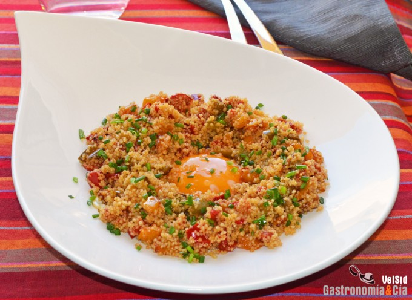

[title]: #()

## Cuscús con pimientos y huevo a la plancha

[img]: #()

[#url]:#()

[recipe-time]: #()

PreviousDay: false

TotalTime: 50 min

CookingTime: 40 min

[ingredients-content]: #()

### Ingredientes (4 comensales)

* 1 pimiento morrón rojo pequeño
* 1 pimiento morrón amarillo pequeño
* 1
pimiento morrón verde pequeño
* 1 diente de ajo
* 1 chalota
* 1 c/c de mezcla
de especias ibérica (u otra al gusto)
* 200 gramos de cuscús precocido
* 200
gramos de caldo de verduras o de jamón
* 4 huevos
* c/n de aceite de oliva
virgen extra
* c/n de sal
* c/n de cebollino fresco.

[content]: #()

Quizá os sorprenda la receta que hoy compartimos con vosotros, pero es
totalmente recomendable porque está para chuparse los dedos, además es un
plato muy fácil y rápido de preparar. Ahora bien, para disfrutar totalmente
de este cuscús con pimientos y huevo a la plancha tenéis que romper la yema
fluida, así como la clara cuajada (que está bajo el cuscús), para mezclar
todo bien. Ya sabéis que una de las salsas más deliciosas es la yema de
huevo sin cuajar…

Pues lo dicho, tomad nota de esta receta de cuscús con verduras y huevo,
podréis prepararla en menos de media hora cualquier día de la semana, lo
que más tiempo ocupa es la cocción de los pimientos, aunque si os gustan
crujientes, bastará con saltearlos unos minutos. También podéis probar esta
receta cambiando los pimientos por unos espárragos verdes, por ejemplo. Ya
nos contaréis cuando la probéis.

### Elaboración

Limpia los pimientos y córtalos en daditos, pela el ajo y la chalota y
pícalos bien finos. Pon una sartén a calentar con un chorro de aceite de
oliva virgen extra y cuando esté caliente incorpora los pimientos, una
pizca de sal y mezcla bien. Rehoga hasta que los pimientos empiecen a estar
dorados, si los quieres un poco crujientes, hazlos a fuego medio-alto.

Cuando los pimientos estén casi a punto, añade el ajo y la chalota y saltea
para que se doren e impregnen su sabor a la verdura. Al estar picados muy
finos se harán enseguida.

Pon el cuscús en una fuente o en un bol amplio, por otro lado pon el caldo
a calentar. Cuando rompa a hervir, vierte el caldo sobre el cuscús, mezcla
para que quede todo mojado, tapa y deja reposar unos cinco minutos. Después
muévelo con un tenedor para que quede suelto.

Cuscús con pimientos y huevo a la plancha

Vierte el cuscús en la sartén con los pimientos, añade las especias (la
cantidad puede variar al gusto) y mezcla bien. Añade también un hilo de
aceite de oliva virgen extra y vuelve a mezclar.

En una sartén con unas gotas de aceite de oliva virgen extra haz los huevos
a la plancha, de uno en uno. Ve poniendo cada huevo en su plato.

Acabado y presentación

Rodea la yema de cada huevo con cuscús de pimientos, y condiméntala con una
pizca de sal. Para terminar, reparte el cebollino fresco recién picado.
¡Buen provecho!
