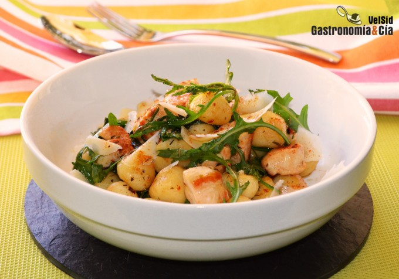

[title]: #()

## Ñoquis con pollo y rúcula

[img]: #()

[#url]:#()

[recipe-time]: #()

PreviousDay: false

TotalTime: 35 min

CookingTime: 30 min

[ingredients-content]: #()

### Ingredientes (4 comensales)
    
* 500 gramos aprox. de ñoquis
* 400 gramos de pechuga de pollo
* 50-60 gramos
    de rúcula
* c/n de mezcla de especias ibérica (ver receta)
* c/n de aceite de
    oliva virgen extra
* c/n de sal
* 20-30 gramos de queso parmesano.

[content]: #()

Los ñoquis o gnocchi no tienen que estar siempre bañados de salsas
cremosas, a menudo ricas en grasas, hay muchas otras formas de disfrutar de
esta preparación de patata. Hoy os dejamos una idea que además de
exquisita, es muy fácil y rápida de hacer, tomad nota de esta receta de
Ñoquis con pollo, rúcula y parmesano, porque os va a encantar.

Con tres ingredientes al alcance de todos y de fácil preparación en la
cocina, os vais a chupar los dedos si seguís la receta que os dejamos a
continuación. Los tres ingredientes principales son ñoquis o gnocchi de
patata, pollo y rúcula, pero también tienen un papel muy importante las
especias, una mezcla de elaboración casera que os hemos recomendado en
varias ocasiones y cuya receta tenéis en los ingredientes. El queso
parmesano, u otro queso curado al gusto, también aporta su toque.

Ya lo veis, es una receta sencilla, económica y deliciosa, ideal para hacer
entre semana, aunque haya poco tiempo para cocinar, porque no se necesitan
más de 20 minutos. Si os gustan los gnocchi caseros los podéis dejar
preparados el fin de semana, pero también podéis elegir un buen producto
comercial, sin olvidar comprobar los valores nutricionales y los
ingredientes con los que se elaboran, que sean los que tienen que ser. A
continuación os dejamos la elaboración paso a paso para preparar los Ñoquis
con pollo y rúcula que ilustran estas líneas, esperamos que os gusten tanto
como a nosotros.

## Elaboración

Prepara una olla con abundante agua para cocer los ñoquis, mientras tanto,
corta la pechuga de pollo en pequeños dados. Pon una sartén a calentar con
un chorrito de aceite de oliva virgen extra y cocina el pollo sin moverlo
hasta que se dore por un lado, entonces añade la mitad de la rúcula y dale
la vuelta al pollo, condimenta con un poco de sal y con las especias.

Cuando el pollo esté dorado por todos los lados, procurando que no quede
muy hecho para que no quede seco, para lo que conviene cocinarlo a fuego
fuerte, incorpora el resto de rúcula, mezcla y retira del fuego.

Ñoquis con pollo y rúcula

Una vez que el agua de la olla rompa a hervir, añade sal y a continuación
los ñoquis. A medida que vayan saliendo a flote, retíralos con una
espumadera bien escurridos, incorpóralos a la sartén con el pollo y la
rúcula.

Añade un hilo de aceite de oliva virgen extra, un poco más de especias
ibéricas, y mezcla bien.

Acabado y presentación

Sirve en los platos los ñoquis con pollo, rúcula y especias ibéricas, y
para terminar añade unas lascas de queso parmesano recién cortadas con el
