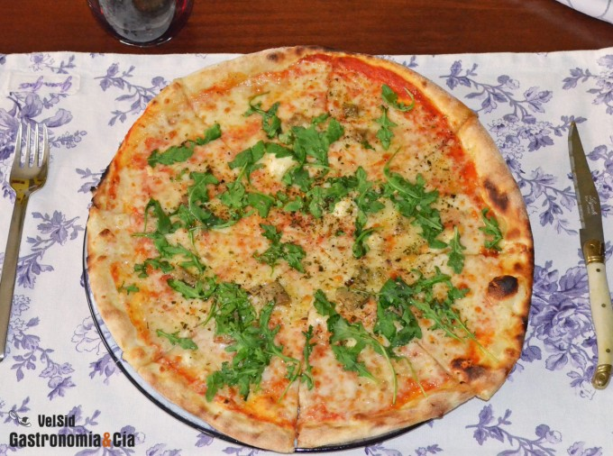

[title]: #()

## 

[img]: #()

[#url]:#()

[recipe-time]: #()

PreviousDay: false

TotalTime: 

CookingTime: 

[ingredients-content]: #()

### 

[content]: #()

Pizza de queso de cabra, foie gras y miel

Los amantes de la pizza no deben dejar de probar esta receta si quieren
disfrutar de una elaboración diferente. La Pizza de queso de cabra, foie
gras y miel está deliciosa, os animamos a que la probéis y la compartáis,
porque os felicitarán por haber hecho una pizza exquisita.

VelSid <http://www.gastronomiaycia.com/author/velsid/>13 dic 15

   - 0Comentar
   <http://www.gastronomiaycia.com/2015/12/13/pizza-de-queso-de-cabra-foie-gras-y-miel/#the-comments>
   -
   -

   -
   - Pin It
   <http://pinterest.com/pin/create/button/?url=http%3A%2F%2Fwww.gastronomiaycia.com%2F2015%2F12%2F13%2Fpizza-de-queso-de-cabra-foie-gras-y-miel%2F&media=http://www.gastronomiaycia.com/wp-content/uploads/2015/12/pizza_cabra_foie_mielp.jpg>
   - [image: Menea esto en Meneame.net]
   <http://meneame.net/submit.php?url=http://www.gastronomiaycia.com/2015/12/13/pizza-de-queso-de-cabra-foie-gras-y-miel/>

[image: Pizza de queso de cabra, foie gras y miel]
<http://www.gastronomiaycia.com/fotos/pizzas/pizza_cabra_foie_miel1.jpg>

Hemos preparado una pizza que está para quitarse el sombrero, tiene sabores
intensos a la vez que elegantes, y con contrastes de sabores que
seguramente os gustarán, quizá no son muy habituales en una pizza, pero
cuando la probéis no dudaréis en repetirla, se trata de la *Pizza de queso
de cabra, foie gras y miel*, ideal para comer en cualquier ocasión e
incluso os diríamos que cortada en porciones de bocado, puede ser un buen
aperitivo para una comida festiva.

Como siempre, os recomendamos que hagáis la masa de pizza en casa, pues
ninguna que compréis tendrá el mismo sabor, en Gastronomía y Cía os hemos
dado varias recetas, pero la que más suele hacerse es la masa de pizza
<http://www.gastronomiaycia.com/2008/06/07/receta-de-masa-de-pizza-crujiente/>
crujiente. A continuación os explicamos cómo hacer la *pizza de queso de
cabra*, *foie gras y miel* aunque no especificamos las cantidades, pues en
estos casos los ingredientes van a ojo, según el tamaño de la pizza y de la
cantidad de pizzas iguales que se vayan a hacer.
Ingredientes

1 base de pizza casera, salsa de tomate, queso rulo de cabra, foie gras
mi-cuit, mozzarella rallada, rúcula, miel, pimienta negra, orégano
(opcional).
Elaboración

Precalienta el horno a 220º C con calor arriba y abajo. Extiende a masa de
pizza en la mesa de trabajo intentando darle forma redonda, si se vuelve a
encoger, déjala reposar cinco minutos para que se destense.

Dispón en primer lugar una cucharada sopera de salsa de tomate en el centro
y ve repartiéndola haciendo movimientos circulares hacia el exterior. A
continuación reparte por toda la masa el queso de cabra desmigado, el foie
gras mi-cuit y la mozzarella rallada.
[image: Pizza de queso de cabra, foie gras y miel]
<http://www.gastronomiaycia.com/fotos/pizzas/pizza_cabra_foie_miel2.jpg>

Introduce la pizza en el horno a altura media, y cuando esté el borde
dorado, unos 15 minutos (el tiempo puede variar según el horno) retírala y
añade la rúcula, un hilo de miel, pimienta negra recién molida y una pizca
orégano seco.
Emplatado

Sirve la pizza recién sacada del horno, si es para repartir, córtala en
porciones triangulares, y si quieres presentar pequeños bocados para un
aperitivo, corta cuadrados o rectángulos de pizza. Recuerda que si se
enfría, la mejor forma de conseguir una pizza recalentada crujiente es esta
<http://www.gastronomiaycia.com/2014/06/16/como-calentar-la-pizza-para-que-quede-crujiente/>.
¡Buen provecho!
