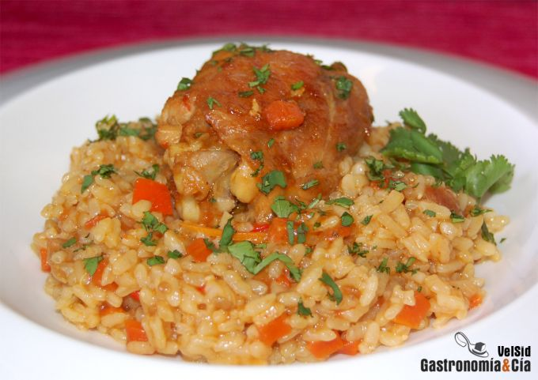

[title]: #()

##  Arroz con pollo
 

[img]: #()

[#url]:#()

[recipe-time]: #()

PreviousDay: false

TotalTime: 1 h

CookingTime: 50 min

[ingredients-content]: #()

### Ingredientes (4 comensales)
    
* 360 gramos de arroz
* 4-6 contramuslos de pollo (también se pueden utilizar
    otros cortes)
* 300 gramos tomates pera
* 6 dientes de ajo
* ½ cebolla grande
* 1
    zanahoria
* ½ pimiento rojo
* 300 mililitros de cerveza
* ¾ c/c de cilantro en
    grano
* unas ramitas de cilantro fresco
* ¾
    c/c de comino en semillas
* 1 c/c rasa de pimentón dulce
* una pizca de
    pimentón picante
* 3/4 c/c de cúrcuma
* 1 c/s de Bovril (opcional)
* 800
    mililitros de caldo de ave
* aceite de oliva virgen extra
* sal.

[content]: #()

El *arroz con pollo* es una *receta* tradicional de América Latina, aunque
en cualquier cocina se elabora un plato con estos dos ingredientes
principales, acompañados de distintos vegetales, especias o incluso
legumbres.

Dentro de las *recetas tradicionales de Arroz con pollo* en Latinoamérica,
hay también muchas variantes dependiendo del país e incluso del cocinero
que la elabore, el resultado puede ser igual de satisfactorio, con
distintos matices pero rico y nutritivo.

Hoy hemos hecho esta adaptación de la receta de arroz con pollo en la que
hemos prescindido del picante porque teníamos invitados que no lo toleran
mucho, pero para nosotros es una delicia incluyendo chile, chipotle o algún pimiento
picante similar.

### Elaboración

Pela la cebolla y córtala en brunoise, lava el pimiento y
practícale el mismo corte, raspa la zanahoria y córtala también en
brunoise. Pela los dientes de ajo y machácalos en el mortero con las
semillas de comino y el cilantro en grano. Ralla los tomates y añádeles
media cucharita de azúcar para reducir la acidez.

Pon una cazuela amplia con un buen chorro de aceite de oliva virgen extra
al fuego y dora el pollo salándolo al gusto. Cuando esté dorado de forma
homogénea, por todos sus lados, baja el fuego y prosigue la cocción. Agrega
la zanahoria, el pimiento rojo, la cebolla y sal, sofríe unos minutos,
hasta que la cebolla empiece a transparentar y moviendo de vez en cuando,
entonces añade el ajo triturado con las especias. Sofríe unos minutos más y
agrega el tomate rallado y el extracto de carne (Bovril). Sube el fuego hasta
que rompa a hervir, vuelve a bajarlo y deja cocer hasta que el sofrito
reduzca casi a la mitad.

Añade entonces el pimentón y la cúrcuma, mezcla bien y riega con la cerveza
volviendo a subir el fuego para que entre en ebullición y después deja
cocer de nuevo a fuego medio-bajo, tapando un poco la cazuela si los trozos
de pollo
son muy grandes para que se hagan bien.

Una vez que haya reducido la salsa y el pollo esté hecho, retíralo de la
cazuela reservándolo en caliente e incorpora el arroz, mézclalo bien con el
sofrito y deja cocinar unos tres minutos para que absorba los sabores. El
pollo se puede dejar cociendo con el arroz si lo deseas, pero a nosotros
nos gusta más separarlo y volverlo a introducir en la olla en los últimos
cinco minutos de reposo del arroz.

Añade entonces el caldo y lleva a ebullición, baja el fuego y deja cocer
tapando el recipiente hasta que el arroz esté en su punto, unos 15 minutos.
Entonces, incorpora el pollo al arroz, tapa la olla y apaga el fuego. Deja
reposar cinco minutos antes de servir, si quedaba algo de caldo se
absorberá.
Emplatado

Sirve el arroz con pollo en los platos elegidos y pica el cilantro fresco,
espolvoréalo sobre el arroz y a comer, está para chuparse los dedos.
