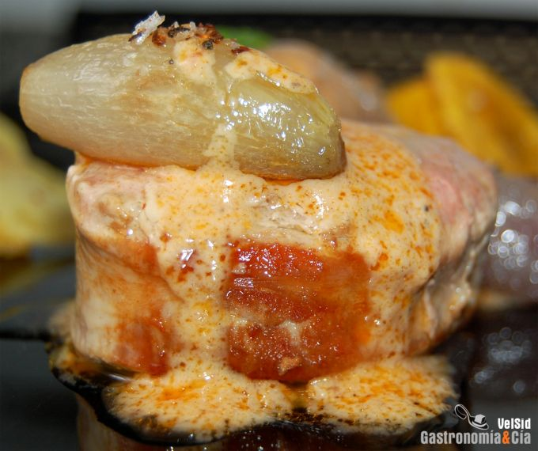

[title]: #()

## Solomillo con coco y curry rojo

[img]: #()

[#url]:#()

[recipe-time]: #()

PreviousDay: false

TotalTime: 50 min

CookingTime: 40 min

[ingredients-content]: #()

### Ingredientes (4 comensales)
    
* 1 solomillo de cerdo (de unos 700 gramos)
* 200 mililitros de leche de coco
* 1 c/s rasa de pasta de curry rojo
* ½ plátano macho
* 1 patata
* 6-8 chalotas
* curry en polvo
* sal de guindillas
* sal corriente
* aceite de oliva virgen
extra.

[content]: #()

La receta de Solomillo con salsa de coco y curry rojo es muy sencilla, pero
muy sabrosa. Se fusionan sabores dulces, picantes y salados que sólo
necesitan un punto de cocción adecuado para convertirse en un festín para
el paladar.

Hoy hemos acompañado este Solomillo con salsa de coco y curry rojo con
crujientes de plátano macho y patatas, además de unas chalotas que como
guarnición, también proporcionan un contraste de sabores. Os animamos a
probar el plato y a que nos contéis vuestro parecer.

### Elaboración

Pela la patata y córtala en finas láminas, pela también las chalotas y
déjalas enteras si son pequeñitas.

Fríe las patatas junto a las chalotas (para que les den sabor) hasta que
estén crujientes, no hace falta que sea en abundante aceite, basta con que
las cubra un poco. Mientras tanto pela el plátano y córtalo también en
finas rodajas. Una vez retiradas las patatas, disponlas sobre papel
absorbente y sálalas al gusto. Si las chalotas no están hechas déjalas unos
minutos más.

Fríe las rodajas de plátano hasta que estén crujientes, sazónalas después
con un poco de sal y curry en polvo. En una sartén con unas gotas de aceite
prepara la salsa de coco con curry rojo, para ello basta con mezclar la
leche de coco con la pasta de curry, una pizca de sal y dejar cocer a fuego
fuerte durante cinco minutos moviendo de vez en cuando.

Finalmente haz los solomillos cortados en medallones previamente. El punto
de cocción será básico, hay que hacerlo al gusto de los comensales. Dora la
parte exterior en la plancha o sartén con un poco de aceite de oliva virgen
extra y deja que se haga según el gusto. Salpimenta también al gusto.

### Emplatado

Sirve el solomillo con los crujientes de patata y plátano macho, acompaña
también con las chalotas a las que añadirás un poco de sal de guindillas.
Termina regando con la salsa de coco y curry rojo y prepárate para
