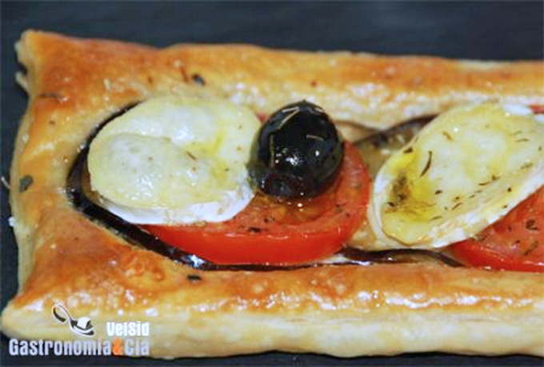

[title]: #()

## Hojaldre de berenjena, tomate y queso de cabra

[img]: #()

[#url]:#()

[recipe-time]: #()

PreviousDay: false

TotalTime: 30 min

CookingTime: 15 min

[ingredients-content]: #()

### Ingredientes (6 comensales)
    
* 2 láminas de hojaldre congelado
* 2 tomates maduros pero firmes
* 1 berenjena
* 1 snack de queso de cabra (no es el mejor
* pero es resultón)
* 12 aceitunas negras
* sal Maldon
* sal corriente
* orégano
* aceite de oliva
virgen extra
* 1 huevo.

[content]: #()

Siempre hemos pensado que el horno nos ahorra mucho trabajo en la cocina,
nos permite lograr exquisitos platos casi sin preparativos, lo mismo da un
asado que una pizza, o este rico *Hojaldre de berenjena, tomate y queso de
cabra* que ayer nos preparamos para cenar. No es una obra de arte, pero nos
permite degustar algo rico y con poca elaboración, ideal para esos días en
los que vamos cansados o tenemos poco tiempo para cocinar.

### Elaboración

Lava la berenjena córtala en rodajas medias, cocínalas 8 minutos al microondas y deja que se enfríen para no estropear el hojaldre.

Descongela el hojaldre con tiempo y
enharina la superficie de trabajo. Extiende las láminas y amásalas
ligeramente con el rodillo, corta en tres porciones cada lámina.

Lava y corta los tomates en rodajas, retírale la piel si lo deseas. Corta
también el queso de cabra obteniendo cuatro rodajas para cada hojaldre. Si
tienes queso de rulo del bueno, mucho mejor, córtalo bien fino, pero menos
cantidad de rodajas.
Bate el huevo con un poco de sal y pinta las láminas de hojaldre que habrás
dispuesto en la bandeja del horno o sobre un Silpat. Coloca a continuación
las rodajas de berenjena, las de tomate y riega con un hilo de aceite y
adereza con la sal Maldon.

Termina colocando sobre los tomates el queso de cabra y las aceitunas, y
espolvoreando un poco de orégano. Si lo deseas, puedes añadir a estos
ingredientes un poco de cebolla, si es cruda, que esté cortada muy fina, si
es caramelizada o confitada, adminístrala al gusto.

Introduce los* hojaldres de berenjena*, tomate y queso de cabra en el horno
precalentado a 200º C, estarán listos cuando la masa se haya hinchado y
dorado, como se aprecia en las fotos.
Emplatado

Puedes servir estos hojaldres en platos rústicos, lucen muy bien. Nosotros
los hemos acompañado con un bouquet
de
rúcula aderezada con una vinagreta de aceitunas negras, delicioso.

También puedes tomar esta idea para hacer unos aperitivos, cortando la masa
con un cortapastas redondo
o cuadrado y procediendo del mismo modo, alternando una rodaja de
berenjena, una de tomate y una de queso.
