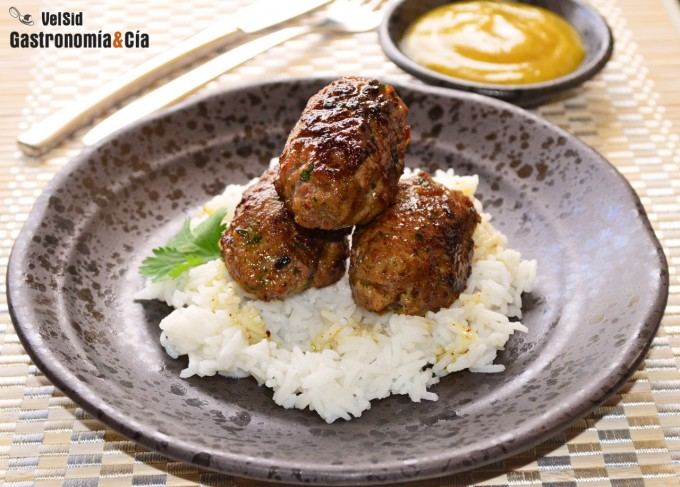

[title]: #()

## Koftas de ternera

[img]: #()

[#url]:#()

[recipe-time]: #()

PreviousDay: false

TotalTime: 

CookingTime: 

[ingredients-content]: #()

### Ingredientes (12 uds.)
    
* 500 gramos de carne de ternera picada
* ½ cebolla morada
* 1 c/c de ajo en
polvo
* 1 c/c rasa de cúrcuma
* 1 c/c de zumaque
* 1 c/c rasa de canela en
polvo
* 1 c/c de comino
* c/n de guindilla seca picada
* 1 c/c de cinco
pimientas
* ½ c/c de sal (o al gusto)
* unas ramitas de cilantro fresco
* aceite
de oliva virgen extra.

Para acompañar

* 120 gramos de arroz aromático (thai, basmati…)
* c/n de salsa de mostaza y
miel.

[content]: #()

Aunque las koftas se elaboran tradicionalmente con cordero, éste
normalmente nos lo comemos a la parrilla, a la brasa o al horno, y para
hacer esta especie de albóndigas especiadas originarias de Oriente Medio y
del sur de Asia a menudo recurrimos a la ternera. No obstante, esta misma
receta de *Koftas de ternera con salsa de mostaza y miel* la hemos hecho en
alguna ocasión con cordero, y quitan el sentido de lo ricas que están.

Las koftas
también denominadas kaftas, kofteh o kuftas, entre otros nombres, son muy
fáciles de hacer, simplemente se trata de picar a carne y condimentarla
bien con especias, ajo, cebolla… Se les puede dar una forma redonda o
alargada, ensartarlas en una brocheta o no. En fin, aquí tenéis una
propuesta de un plato principal que os va a encantar, unas *albóndigas
especiadas* con*arroz aromático* y *salsa de miel y mostaza*, para chuparse
los dedos.

### Elaboración

Prepara la salsa de mostaza y miel como [explicamos aquí](http://www.gastronomiaycia.com/2011/07/26/salsa-de-mostaza-y-miel/), así
tendrá tiempo de reposar y amalgamar sabores. Prepara también el arroz para
cocerlo y que esté listo justo cuando se hayan hecho las koftas.

Pon la carne picada en un cuenco amplio para mezclarla con el resto de
ingredientes. Pela la cebolla y pícala en brunoise, ponla en el cuenco e
incorpora también el ajo en polvo, la cúrcuma, el zumaque, la canela, el
comino, la guindilla, las pimientas y la sal.

Pica el cilantro fresco bien fino y añádelo también, entonces mezcla bien
con una espátula o con las manos, que las especias estén bien repartidas
por la carne para que ofrezca un sabor homogéneo.

Haz porciones de carne de unos 45-50 gramos y dales la forma que desees,
redondas o un poco ovaladas y reserva en frío hasta el momento de
cocinarlas, pero puedes hacerlas inmediatamente. Para ello simplemente pon
un fondo de aceite de oliva virgen extra en una sartén y llévala al fuego a
temperatura media.

Cocina las koftas dándoles la vuelta para que se doren de forma homogénea y
que se cocinen hasta el interior.
Emplatado

Sirve una cama de arroz aromático y coloca encima las koftas o *albóndigas
de ternera especiadas*. Acompaña con la salsa de mostaza y miel en una
salsera para que cada comensal se sirva al gusto. ¡Buen provecho!
