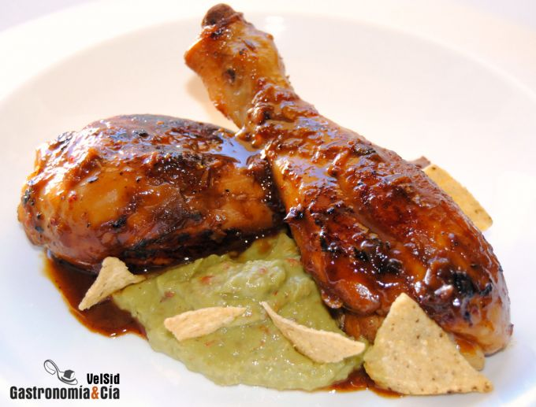

[title]: #()

## 

[img]: #()

[#url]:#()

[recipe-time]: #()

PreviousDay: false

TotalTime: 

CookingTime: 

[ingredients-content]: #()

### 

[content]: #()

Tan sencillos como sabrosos son los Muslos de *pollo con naranja* y soja,
fáciles de hacer, saludables, ligeros, nutritivos y ricos hasta decir
basta, la *receta* ofrece una combinación de sabores que conquista a los
paladares más exigentes.

Esta receta puedes hacerla cualquier día de la semana, no te va a llevar
más tiempo que hacer el tradicional *pollo al ajillo*, lo que seguramente
conseguirás es sorprender a tus comensales con estos *Muslos de pollo con
naranja y soja*. No dejes de comprar o hacer un buen pan para no dejar
rastro de la salsa en el plato.
Ingredientes (4 comensales)

8 muslos de pollo, 150 gramos de zumo de naranja natural, 40 gramos de
salsa de soja, 2 chalotas
<http://www.gastronomiaycia.com/2008/09/05/chalotas-o-escalonias/>, guindilla
o chile seco molido,aceite de oliva virgen extra, sal.

Salsa de aguacate

2 aguacates, 40 gramos de tomates secos en aceite, ½ cebolla morada, 1 c/c
rasa de jengibre en polvo, pimienta negra recién molida, 2 c/s de zumo de
naranja natural, 1 c/s de zumo de limón natural, chile o guindilla al gusto
, sal.

Elaboración

Limpia los muslos de pollo, retírales la piel y sálalos ligeramente.
Prepara el zumo de naranja y pela y pica las chalotas.

Pon una cazuela de paredes bajas o una sartén amplia al fuego con un fondo
de aceite de oliva, cuando esté caliente, incorpora los muslos de pollo y
dóralos de forma homogénea, dándoles la vuelta de vez en cuando.

Cuando la superficie esté dorada, reduce el fuego y añade la chalota para
que se poche ligeramente, cuando empiece a transparentar, añade el zumo de
naranja mezclado con la salsa de soja y la guindilla.
[image: Muslos de pollo con naranja y soja]
<http://www.gastronomiaycia.com/fotos/recetas/muslos_pollonaranjasoja2.jpg>

Deja cocer a fuego medio, tapando la sartén pero sin encajarla, dejando una
pequeña salida para el vapor. Si al terminar la cocción del pollo queda el
jugo muy fluido, sube un poco el fuego, destapa totalmente y deja reducir
dándoles vueltas a los muslos de pollo para que se impregnen bien.

Prepara la salsa de aguacate, pon en el mortero o en el complemento de la
batidora (con lo que te vaya mejor) los aguacates pelados y deshuesados, la
cebolla pelada y troceada, los tomates secos escurridos, el jengibre, la
pimienta el zumo de naranja y de limón, la guindilla y un poco de sal,
tritura y prueba por si fuera necesario rectificar de especias o sal.
Emplatado

Sirve la *receta de pollo con naranja* y soja acompañados de la salsa de
aguacate, y unos trocitos de nachos si lo deseas, quizá los comensales
después pidan más para comer como el guacamole, aunque con el pollo está
genial. Tal vez prefieras servir la salsa aparte y que cada comensal se la
sirva al gusto. ¡Buen provecho!
