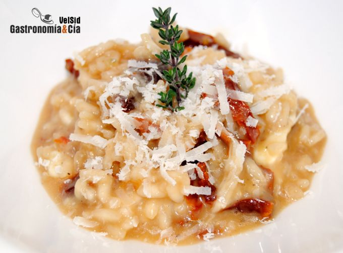

[title]: #()

## Risotto de mozzarella y tomate seco

[img]: #()

[#url]:#()

[recipe-time]: #()

PreviousDay: false

TotalTime: 

CookingTime: 

[ingredients-content]: #()

### Ingredientes (4-6 comensales)
    
* 400 gramos de arroz carnaroli o arborio
* 2
chalotas
* 160 ml. de vino blanco seco
* 1'5 litros de caldo de verduras y
jamón
* 250 gramos de mozzarella fresca
* 100 gramos de tomates secos en
aceite (se
puede variar la cantidad al gusto, según lo hidratados que estén los
tomates, su peso variará)
* 1 c/s de tomillo fresco (las hojas)
* pimienta
negra recién molida
* parmesano recién rallado
* sal
* aceite de oliva virgen
extra.

[content]: #()

En el [libro Cocina Italiana](http://www.gastronomiaycia.com/2010/12/03/cocina-italiana-de-maxine-clark/)
encontramos
la idea de esta *receta de risotto* con *mozzarella y tomate seco* que
adecuado a nuestro gusto y despensa, tenemos que decir que hemos
disfrutado. Ahora será cuestión de hacer distintas variantes de esta receta
de risotto, se nos ocurren varios ingredientes que incorporar, aportando
distintos matices y combinaciones de sabor.

Nos encantaría que también probarais el *Risotto de mozzarella y tomate
seco*, y compartierais con todos nosotros vuestras propuestas. Si tenéis
posibilidad de hacerlo con mozzarella de búfala
no
lo dudéis, y sobre el tomate seco, si tiene un porcentaje de hidratación
mínimo, incorporarlo al principio, si se trata de un tomate seco más
tierno, podéis añadirlo a mitad de la cocción. En este caso hemos utilizado
el tomate que tenemos más seco, así se ha ido rehidratando con la cocción
del arroz a la vez que le transmitía el sabor.

### Elaboración

Pela las chalotas, córtalas por la mitad a lo largo y después pícala bien
fina. Pon el caldo a calentar en el microondas o en un cazo. Escurre la
mozzarella y córtala en daditos, trocea también los tomates, no demasiado
pequeños.

Pon una cazuela al fuego con el mismo aceite de los tomates, añade los
tomates y la chalota, y pocha a fuego suave hasta que ésta esté
transparente. Añade el arroz y sube un poco el fuego, no dejes de remover y
cuando esté nacarado, añade el vino, deja reducir moviendo de vez en cuando.

Una vez que el arroz se haya quedado seco, empieza a incorporar el caldo
caliente poco a poco, es decir, de vaso en vaso, vierte el primero y ve
moviendo de vez en cuando mientras se va haciendo el arroz, y cuando el
caldo se haya absorbido, vierte otro vaso. Así hasta que viertas el último.
Con el primer vaso de caldo añade también el tomillo, la pimienta y un poco
de sal (aunque dependerá del punto de sal que tenga el caldo.

En el momento en el que viertas el último vaso de caldo, incorpora la
mozzarella, deja cocer hasta que se haya consumido la mitad del caldo del
último vaso, mezcla para que la mozzarella se funda ligeramente y se
integre con el arroz, retira del fuego y deja reposar hasta que el punto
cremoso del risotto esté a tu gusto. Este no conviene que quede muy seco.
Emplatado

Sirve el *Risotto de mozzarella* y tomate seco en el plato y termina
rallando un poco de queso parmesano, decora con una ramita de tomillo y
sirve enseguida. ¡Buen provecho!
