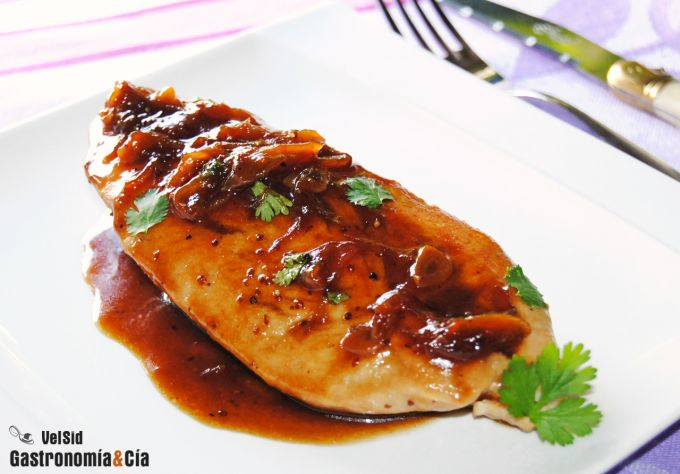

[title]: #()

## Pollo con salsa de mostaza, cerveza y miel

[img]: #()

[#url]:#()

[recipe-time]: #()

PreviousDay: false

TotalTime: 

CookingTime: 

[ingredients-content]: #()

### Ingredientes (4 comensales)
    
* 4 pechugas de pollo (también se puede hacer con pavo)
* 1/2 cebolla morada
* 1 diente de ajo

*  120 gramos de cerveza
* 20 gramos de salsa de soja
* 10 gramos de mostaza
antigua
* 20 gramos de miel
* cilantro fresco
* aceite de oliva virgen
extra
* pimienta
negra
* sal.

[content]: #()

La carne de pollo está considerada un alimento básico, es una carne blanca
saludable, con poca grasa, económica y además muy versátil. A menudo os
presentamos recetas de pollo para que dispongáis y disfrutéis de distintas
formas de elaboración, hoy la propuesta es esta pechuga de *pollo con salsa
de mostaza, cerveza y miel*, una verdadera delicia.

Preparamos esta salsa para enriquecer la pechuga de pollo que, cocinada en
su punto, resulta muy jugosa. Pero si además está aderezada con esta *salsa
de mostaza,
cerveza y miel*, se convierte en un plato exquisito. Esta salsa también
acompaña muy bien a otros tipos de carne, como el pavo, el cerdo o el
conejo. La propuesta de hoy es esta *receta de pollo* a la plancha, muy
fácil y rápida de elaborar.

### Elaboración

Pon una sartén amplia a calentar con un poco de aceite de oliva virgen
extra, salpimenta las pechugas de pollo por los dos lados y hazlas a la
plancha dorándolas por fuera y dejándolas jugosas por dentro, un punto
menos de lo que las haces normalmente.

Mientras se hace el pollo, pela la cebolla y córtala en juliana, pela el ajo y córtalo
en láminas. Pon en un cuenco la cerveza, la salsa de soja, la mostaza y la
miel, mezcla bien.

Retira el pollo de la sartén y añade un poco de aceite de oliva virgen
extra si es necesario, incorpora la cebolla y el ajo, cocina a fuego medio,
moviendo de vez en cuando, hasta que se ablanden. Añade a continuación la
mezcla del cuenco, una pizca de sal, pimienta y unas hojas de cilantro, y
lleva a ebullición, después baja el fuego para que reduzca.

Cuando la salsa de mostaza, cerveza y miel esté casi en su punto (pruébala
por si es necesario rectificar), como un almíbar, reincorpora el pollo y
deja un minuto por cada lado para que se impregne y coja temperatura.
Emplatado

Sirve la *pechuga de pollo* con la *salsa* de cebolla, mostaza y demás.
Termina con unas hojas de cilantro fresco y a comer. ¡Buen provecho!
