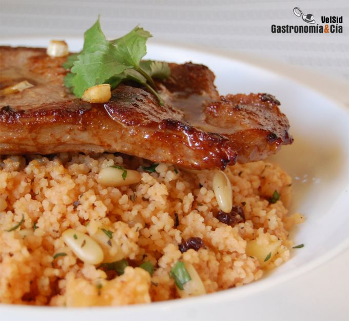

[title]: #()

## 

[img]: #()

[#url]:#()

[recipe-time]: #()

PreviousDay: false

TotalTime: 

CookingTime: 

[ingredients-content]: #()

### 

[content]: #()

El *Cuscús con cordero* es un plato de tradición marroquí que ha cruzado
fronteras y actualmente hay tantas recetas de *Cuscús con cordero* como
cocineros. Podemos hacer esta receta con muchas variantes, distintos
vegetales y especias pueden hacer que cada vez disfrutemos de un plato
nuevo.

Hoy hemos hecho una rápida elaboración de este receta, hay que agradecer
que esta sémola <http://www.gastronomiaycia.com/2009/07/22/semola/> sea de
tan rápida cocción, tan versátil y nutritiva. Con el *cuscús*, unas
chuletas de *cordero*, especias y un sofrito básico, puedes obtener un
plato con el que tus comensales se chuparán los dedos.

No hemos prescindido de las pasas y piñones que tan bien acompañan al
cuscús, aportando por un lado dulzor y por el otro textura. Con poco tiempo
para cocinar y con ganas de disfrutar en la mesa, el Cuscús con cordero se
presenta como una buena elección.
Ingredientes (4 comensales)

250 gramos de cuscús, 250 gramos de agua (o caldo vegetal), 4-8 chuletas de
cordero (según el peso), ½ puerro, 4 dientes de ajo,3 centímetros de raíz
de jengibre <http://www.gastronomiaycia.com/2008/05/07/el-jengibre/>, 1 c/p
de hierbabuena seca, 1 c/p de Tandoori Masala, 1 manzana pequeña o media
grande (Fuji por ejemplo), 3 c/s de pasas, 3 c/s de piñones, unas ramitas
de cilantro fresco, aceite de oliva, sal.
Elaboración

Empieza elaborando el cuscús, el procedimiento es diferente a como lo
hacemos para el Tabulé <http://www.gastronomiaycia.com/2008/08/03/tabule/>.
Pela y pica el puerro y ponlo en una cazuela o sartén amplia con un poco de
aceite y una pizca de sal a fuego medio-bajo. Rehógalo hasta que esté
tierno e incorpora entonces dos dientes de ajo pelados y picados y la raíz
de jengibre también, pelada y picada bien pequeñita.

Sofríe hasta que el ajo tome color y agrega la manzana pelada y cortada en
daditos, los piñones y las pasas, continúa rehogando a fuego medio hasta
que los piñones se doren y las pasas se inflen. A continuación vierte el
cuscús, mézclalo bien con el resto de ingredientes, añade sal al gusto, la
hierbabuena y el *Tandoori Masala*, vuelve a mezclar y vierte el agua o el
caldo.
[image: Cuscús con cordero]
<http://www.gastronomiaycia.com/fotos/cusc%C3%BAs-con-cordero/cuscus_cordero2.jpg>

Sube el fuego y cuando rompa a hervir apágalo, retira el recipiente del
fogón y tápalo, déjalo entre 5 y 10 minutos para que se hidrate, mientras
tanto pica el cilantro
<http://www.gastronomiaycia.com/2008/07/08/cilantro-o-coriandro/> e
incorpóralo al cuscús, mézclalo bien con una cuchara de acero inoxidable,
ayuda a que el grano quede suelto.

Pon una sartén al fuego con un poco de aceite de oliva y haz el cordero al
punto que te guste, sálalo y cuando estés a punto de retirarlo del fuego
incorpora los dientes de ajo restantes para que desprendan su sabor y aroma
a la carne.
Emplatado

Sirve el cuscús con cordero en un plato amplio, el cuscús como base y el
cordero sobre él regándolo con un poco del jugo de la sartén. ¡Buen
provecho!
