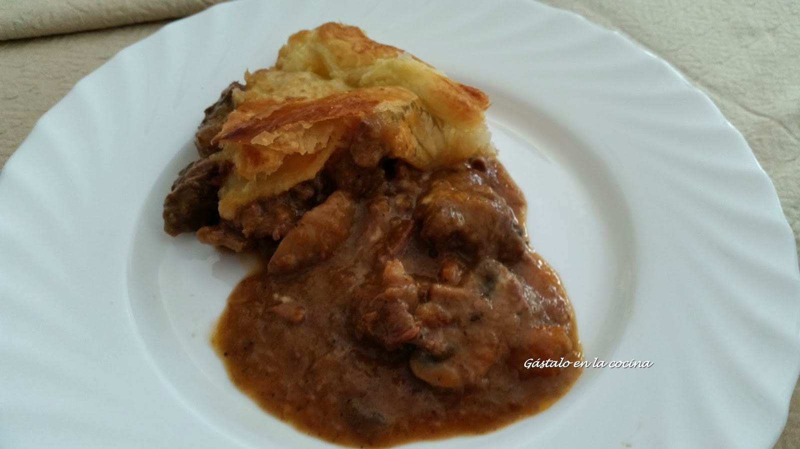

[title]: #()

## Pastel de carne, cerveza negra y queso

[img]: #()

[#url]:#()

[recipe-time]: #()

PreviousDay: false

TotalTime: 4 h 30 min

CookingTime: 3 h

[ingredients-content]: #()

### Ingredientes (4 raciones)*
                 
                 
- 3 cebollas
- 1 cucharada de aceite de oliva
- 1 rama de romero fresco (las hojas)
- 3 dientes de ajo rallados
- 50 gr de mantequilla
- 2 zanahorias en rodajas
- 250 gr de champiñones
- 400 gr de carne de falda de ternera en dados
- 1 lata de cerveza negra, preferiblemente Guinness
- 1 cucharada colmada de harina
- 1 pastilla de carne
- 1 pizca de pimienta negra
- 2 masas de hojaldre
- 200 gr de cheddar rallado
- 1 huevo batido

[content]: #()

Vamos a necesitar una sartén o cacerola con tapa que se pueda meter al
horno, pero si no la tienes, no te preocupes, antes de meterlo al horno,
puedes pasar el guiso a un molde de horno y taparlo con un trozo de papel
albal, yo os aviso cuando tengamos que hacer esto.

## Elaboración 

1. Ponemos a calentar una sartén honda o una olla.

2. Cortamos las cebollas en juliana y las añadimos a la sartén con un
la pizca de pimienta negra. Removemos de vez en cuando mientras preparamos
el resto de ingredientes.

3. Echamos las hojas de romero limpias y secas a la sartén.

4. Rallamos o pasamos por una prensa de ajos los 3 dientes de ajo. Los
añadimos a la sartén. Mezclamos todo.

5. Este es el mejor momento para mí: añadimos el trozo de mantequilla,
que junto con el romero y la cebolla hacen una mezcla de olores muy muy
buena.

6. Echamos las zanahorias en rodajas y un par de ramas de apio en
rodajas también, ahora bien, si no sois muy de apio suprimirlo como yo...

7. Limpiamos los champiñones y los partimos en láminas. Jamie Oliver
utiliza portobello, pero no son fáciles de encontrar. Yo siempre uso
champiñones comunes, pero frescos, nada de champiñones de lata!! Los
añadimos a la sartén desmenuzándolos con las manos.

8. Los dados de carne van ahora directos a la sartén. Marcamos la
carne, removemos.

9. Ahora ponemos la lata de cerveza -menos un par de tragos- y la
cucharada de harina, si es maizena, mejor.

10. En este punto, Jamie Oliver indica que añadamos un chorro de agua o
de caldo de carne, tras hacerla muchas veces, prefiero no echarle más
líquido que la cerveza ya que sino me queda bastante más caldoso que a él.
Como relleno para un pastel, es preferible que el guiso sea espeso, de
sabor concentrado. Lo que si hago es añadirle en este momento una pastilla
de carne.

11. Tapamos la sartén o la olla y lo metemos al horno a 180ºC durante 2
horas. Si tu sartén u olla no es apta para el horno o lo dudas, pasa el
guiso a un molde de horno y tápalo casi completamente con papel albal.

12. Tras dos horas, sacamos el guiso del horno y comprobamos que la
consistencia es espesa, si no, lo metemos unos 10 minutos más, esta vez sin
tapa -no queremos caldo líquido en nuestro pastel-. Batimos el huevo y lo
reservamos, lo utilizaremos  después para pintar el hojaldre.

12. Tras dos horas probablemente siga con líquido, podemos retirar la chicha y reducir la salsa en el fuego. **Recuerda**: la tapa de la olla está muy caliente.

13. Vamos a preparar el hojaldre: cortamos 1/3 de una de las masas y la
pegamos a continuación de la otra para conseguir una masa del doble de
tamaño que la primera.

14. Colocamos la masa más grande en el molde, ajustada al fondo y las
paredes. Lo que sobre por los bordes no lo cortamos, nos servirá para
cerrar luego el pastel.

15. Mezclamos la mitad del queso cheddar (100 gr) rallado -o troceado-
con el guiso y lo añadimos todo al molde encima del hojaldre. En este
momento trabajamos muy deprisa ya que el guiso está caliente y si
tardamos mucho estropearemos el hojaldre. Ahora añadimos por encima la
otra mitad del queso (100 gr).

16. Amasamos la masa pequeña de hojaldre hasta conseguir el mismo
tamaño que el molde que estamos usando para el pastel. Pintamos con huevo los
bordes que sobresalen de la masa de hojaldre grande, la de debajo.

17. Hacemos unos cortes superficiales en diagonal en la tapa de hojaldre
para que sea más crujiente. La pintamos con huevo y colocamos con rapidez
encima del molde. Arrugamos los sobrantes de la masa de debajo sobre la
masa de la tapa para cerrar bien el pastel. No nos vamos a preocupar de que
quede bonito, el horno lo va a transformar en un pastel rustico precioso,
de verdad!!

18. Ahora vamos con el pastel al horno, a 180ºC durante 40 minutos o
hasta que esté dorado y bien hecho el hojaldre.

19. Ya solo queda sacarlo y dejarlo reposar unos 10 minutos. Podemos
aprovechar para preparar unos guisantes congelados rehogados con un poco
de mantequilla y sal. Son el acompañamiento perfecto para este plato.

Sé que una receta tan larga da pereza pero os diré que: es fácil de
hacer, casi no requiere tiempo, solo prepararla con antelación, es una
receta sana y nutritiva, la mayor parte del tiempo se hace sola en el
horno y no tienes que estar pendiente, es perfecta para preparar cuando hay
invitados porque es muy vistosa, está buenísimo y te hará sentirte
orgullos@ de su sabor!!

Os dejo el vídeo donde Jamie Oliver prepara esta receta en su programa.
Si oís el crujido del hojaldre cuando saca del horno el pastel, seguro
que lo vais a hacer!! ;)

Espero que os guste, lo disfrutéis y se convierta en una de vuestras
recetas típicas, como ha pasado en mi casa.
