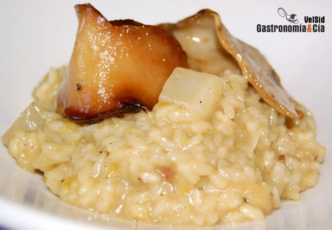

[title]: #()

## Risotto con boletus confitados

[img]: #()

[#url]:#()

[recipe-time]: #()

PreviousDay: false

TotalTime: 

CookingTime: 

[ingredients-content]: #()

### Ingredientes (4 comensales)
    
* 400 gramos de arroz carnaroli (o arborio, baldo…)
* 200 ml. de vino blanco
* 1 puerro
* 2 dientes de ajo
* 1 nabo
* 1 c/s de Bovril
* 60 gramos de boletus
edulis deshidratados
* 1 litro de caldo vegetal (restar al caldo el agua en
la que se han rehidratado los boletus)
* 80 gramos de queso parmesano
* 1 c/p
de cúrcuma
* ½ c/p de pimienta de Jamaica
* tomillo
* 2 c/s de sirope de arce
* 2 c/s de miel
* aceite de oliva virgen extra
* sal.

[content]: #()

Se nos ha pasado la semana casi sin darnos cuenta de que no habíamos comido
risotto, la verdad es que hemos disfrutado mucho de todos los menús, pero
el cuerpo ya nos pedía un Risotto con boletus confitados, un plato ideal
para terminar la semana laboral.

El Risotto con boletus, aromatizados con miel y tomillo (que delicia
también para acompañar una carne), no podemos decir que es una receta
ligera, pero es nutritiva y está tan sabrosa que hay que ser generoso en el
servicio. Como características de este plato, mencionar que hemos buscado
la crujibilidad y un contraste refrescante y ligeramente picante en el
nabo, que a su vez se suaviza con el queso, pero si no es del agrado de los
comensales, se puede prescindir de él.

### Elaboración

Pon los boletus o ceps en agua tibia para que se rehidraten unas horas
antes. Cuando vaya a ponerte a cocinar, escurre bien las setas y añade el
agua al caldo que pondrás a calentar para hacer el risotto. Pon aceite de
oliva en un cazo, la cantidad suficiente para que cubra los boletus, añade
la miel y una pizca de tomillo, ponlo al fuego y calienta hasta los 50-60º
C e introduce las setas para que se confiten.

Pela y pica el puerro, pela los dientes de ajo y dales un golpe con la hoja
del cuchillo (un poco de presión para que se abra ligeramente). Pela el
nabo y córtalo en dados. Pon la cazuela al fuego con un buen chorro de
aceite de oliva y pocha a fuego lento el puerro y los ajos, cuando empiece
a caramelizar, incorpora el nabo, el sirope de arce y sal al gusto, mezcla
bien y añade el arroz.


Mueve el arroz hasta que el grano empiece a transparentar, incorpora
entonces el vino y deja reducir, a continuación condimenta con la cúrcuma,
la pimienta de Jamaica, el Bovril y mezcla bien, empieza entonces a añadir
el caldo caliente vaso a vaso, incorpora el primero y no añadas el
siguiente hasta que el anterior no se haya absorbido. Recuerda que debes
mover el arroz con una espátula o cuchara de madera casi continuamente.

Cuando hayas añadido el último vaso de caldo, incorpora también el
parmesano rallado y mezcla bien, termina de mantecar y si le queda un poco
de caldo, deja reposar un par de minutos antes de servir.

Retira los boletus del cazo en el que estaban confitando.

### Emplatado

Sirve el risotto bien cremoso y acompáñalo con los boletus confitados.
Puedes terminar con un poco más de queso parmesano rallado o en lascas si
lo deseas. ¡Buen provecho!
