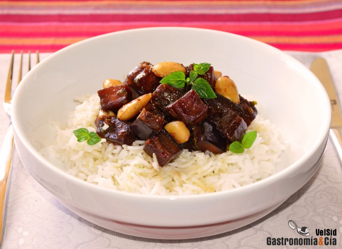

[title]: #()

## Arroz basmati con berenjena y almendras

[img]: #()

[#url]:#()

[recipe-time]: #()

PreviousDay: false

TotalTime: 

CookingTime: 

[ingredients-content]: #()

### Ingredientes (4 comensales)
    
* 500 gramos de berenjena
*  60 gramos de ajos tiernos
*  1 trozo de raíz de
jengibre (una nuez)
*  60 gramos de almendra entera cruda (Marcona)
*  ½ c/c de
nuez moscada recién rallada
*  ½ c/c de pimienta negra recién molida
*  ½ c/c
de chile en polvo
*  ¼ c/c de comino en polvo
*  ½ c/c de lemon grass en polvo
* 120 gramos de salsa de soja dulce (Kecap manis)
*  200 gramos de agua
*  unas
ramitas de menta fresca
*  1-2 c/s de aceite de sésamo
*  c/n de aceite de
oliva virgen extra
* sal.

[content]: #()

Un entrante ideal para un lunes sin carne o para cualquier día que se
quiera disfrutar del Arroz basmati con berenjena y almendras que os
proponemos, es un plato muy sabroso, nutritivo y ligero, leed la receta a
continuación y tomad nota de ella, seguro que encontraréis el momento de
probarla.

La elaboración es muy sencilla, un buen arroz aromático, suelto y suave
como base, y la berenjena salteada con especias y salsa de soja dulce.
Resulta muy sabrosa y especiada, como lo es la Berenjena frita con salsa
oriental, por lo que el arroz es el acompañamiento ideal. Os proponemos
este Arroz con berenjena y almendras como entrante, pero también podéis
servirlo como guarnición de carne o pescado, haciendo un plato único muy
rico y completo.

### Elaboración

Lava bien la berenjena, corta los dos extremos y después córtala en dados.
Ponla en un recipiente con sal y déjala reposar unos diez minutos para
retirar el amargor. Después enjuágala y sécala bien.

Pela los ajos tiernos y córtalos en rodajas finas, pela el jengibre y
pícalo bien fino. Prepara las especias, puedes variar las cantidades al
gusto, si quieres que sea más o menos picante, que predomine el cítrico…

Pon una sartén grande a calentar con un poco de aceite de oliva virgen
extra, cuando esté caliente, a temperatura media, incorpora el jengibre y
el ajo tierno picado, rehoga unos minutos y añade la berenjena, la almendra
y sal al gusto. Baja uno o dos puntos más el fuego y sofríe la berenjena
con la almendra unos ocho minutos.

Incorpora las especias, dale un par de vueltas al guiso y moja con la salsa
de soja dulce y el agua, añade la menta picada y cuece hasta que las
berenjenas estén tiernas y glaseadas. Retira la sartén el fuego y adereza
con el aceite de sésamo, mezcla y reserva en caliente.

Mientras se hacen las berenjenas con almendras puedes cocer el arroz, hazlo
con agua y sal en un cazo, como haces normalmente, hasta que esté en su
punto.

Emplatado

Sirve el arroz basmati coronado con las berenjenas glaseadas con almendra y
decora con unas hojitas de menta fresca. ¡Buen provecho!

Abreviaturas
c/s = Cuchara sopera
c/p = Cuchara de postre
c/c = Cuchara de café
c/n = Cantidad necesaria
