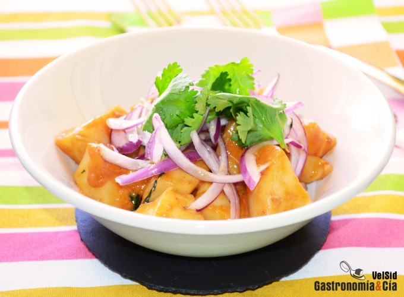

[title]: #()

## 

[img]: #()

[#url]:#()

[recipe-time]: #()

PreviousDay: false

TotalTime: 

CookingTime: 

[ingredients-content]: #()

### 

[content]: #()

http://www.gastronomiaycia.com/2014/06/05/sepia-con-jengibre-y-leche-de-coco/
Receta Sepia con jengibre y leche de coco, una tapa o plato principal muy
fácil de hacer. Es como un sabroso curry, ligeramente picante, dulce,
ácido… La sepia resulta tierna y muy gustosa, y además es un platillo
saludable y nutritivo.
VelSid
05 JUN 2014
0Comentar
Pin It

Cuando salimos de tapas, habitualmente encontramos sepia con ajo y perejil,
sepia con all i oli, sepia con patatas… Pues aquí tenéis un aperitivo o
tapa diferente que os va a encantar, y os animamos a probarla porque
también se puede disfrutar del tapeo en casa, o quizá os guste tanto esta
receta de Sepia con jengibre y leche de coco que la prepararéis como plato
principal (nosotros lo hacemos).

La elaboración es sencilla y rápida, a continuación os explicamos la receta
paso a paso para hacer esta sepia ligeramente picante, con jengibre, leche
de coco, cilantro… es casi como un curry de sepia. Tomad nota y nos contáis.

Ingredientes (4-6 comensales)

600 gramos de sepia limpia, 1 trozo de raíz de jengibre (una nuez), 3
dientes de ajo, 2 c/s de aceite de oliva virgen extra, 1 c/c colmada de
Gochu Jang (o pasta de curry rojo), 100 gramos de leche de coco , 20 gramos
de salsa de soja, una pizca de sal, 1 c/s de zumo de limón natural, 6
ramitas de cilantro fresco, ½ cebolla morada, c/n de aceite de sésamo.

Elaboración

Lava la sepia y sécala bien, córtala en trozos de un bocado. Pela la raíz
de jengibre y rállala. Pela los dientes de ajo y rállalos también, o si lo
prefieres utiliza la pasta de ajo y jengibre que tengas preparada.

Pon una sartén a calentar con el aceite de oliva virgen extra y sofríe la
pasta de jengibre y ajo a fuego moderado, cuando se haya hecho un poco
incorpora la sepia y sube el fuego. A continuación añade el Gochu Jang,
dale un par de vueltas.

Incorpora la leche de coco, la salsa de soja, una pizca de sal si fuera
necesario y el zumo de limón, añade también las hojas de dos ramitas de
cilantro picadas. Cocina a fuego fuerte, pero no al máximo, hasta que
reduzca la salsa.

Pela y corta en juliana la cebolla morada y limpia las hojas restantes de
cilantro.

Emplatado

Sirve la sepia en cazuelitas o cuencos y corónala con la cebolla y el
cilantro fresco. Termina con un hilo de aceite de sésamo. ¡Buen provecho!

Abreviaturas
c/s = Cuchara sopera
c/p = Cuchara de postre
c/c = Cuchara de café
c/n = Cantidad necesaria
