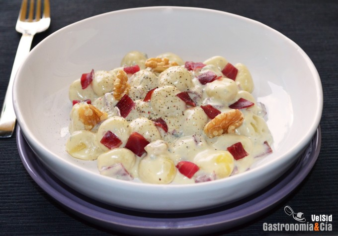

[title]: #()

## Ñoquis con salsa de queso azul, cecina y nueces

[img]: #()

[#url]:#()

[recipe-time]: #()

PreviousDay: false

TotalTime:

CookingTime:

[ingredients-content]: #()

### Ingredientes (4 comensales)
*   1 chalota
*   200 gramos de nata para cocinar (18% M.G.)
*   100 gramos de queso azul
*   ¼ c/c de nuez moscada
*   ½ c/c de pimienta negra
*   1 c/c de ajo en polvo (opcional)
*   6 lonchas de cecina
*   8-10 nueces
*   500 gramos de ñoquis de patata
*   aceite de oliva virgen extra
*   c/n de sal.

[content]: #()

Si tenéis unos **ñoquis** para comer y queréis hacer una salsa rápida, sencilla y muy sabrosa, podéis probar esta con **queso azul**, **cecina y nueces**. Claro, es un plato ideal para quienes disfrutan de esta variedad de queso, se puede elegir el que más os guste. En caso de que el queso azul no sea de vuestro agrado no penséis que esta receta no es para vosotros, pues podéis sustituirlo por otro tipo de queso que funda bien para hacer una salsa.

A continuación os explicamos cómo hacer esta receta de **Ñoquis con salsa de queso azul, cecina y nueces**, un plato muy energético que podréis tener listo en menos de media hora, así que es una receta ideal para preparar cualquier día de la semana en el que no se tenga mucho tiempo o ganas de estar en la cocina. Que eso no impida disfrutar de la comida casera y recién hecha.

### Elaboración

Pela la chalota y pícala muy fina, pon una sartén a calentar con un poco de aceite de oliva virgen extra y [póchala](https://gastronomiaycia.republica.com/2012/09/20/truco-de-cocina-pochar-y-caramelizar-la-cebolla-en-menos-tiempo/) hasta que empiece a dorar. Entonces añade la nata y el queso azul troceado para que empiece a fundir.

Incorpora la nuez moscada recién rallada, la pimienta negra recién molida y de forma opcional, el ajo en polvo. Ve moviendo de vez en cuando para que el queso se vaya integrando en la nata y para que no se agarre al fondo. Pruébala para ver si es necesario añadir sal.

La salsa estará lista cuando el queso esté fundido y haya espesado un poco, pero no la reduzcas mucho porque los ñoquis la absorberán muy bien.

Mientras se hace la salsa corta las lonchas de cecina en cuadraditos y abre las nueces, trocéalas y reserva.

Pon una olla con abundante agua a calentar y con una pizca de sal, cuando rompa a hervir incorpora los ñoquis y a medida que éstos vayan subiendo a la superficie, ve retirándolos y poniéndolos en un recipiente en el que se puedan salsear.

Cuando los [ñoquis](https://gastronomiaycia.republica.com/2014/11/26/noquis-con-rucula-pinones-y-tomates-secos/) estén hechos, vierte la salsa de queso azul, las nueces troceadas y la cecina, reservando un poco para servir una vez en el plato.

### Emplatado

Sirve los **ñoquis con salsa de queso azul**, debe ser una salsa muy cremosa y fluida. Reparte las nueces y la cecina reservada y termina con un golpe de molinillo de pimienta negra. ¡Buen provecho!

_Abreviaturas_  
c/s = Cuchara sopera  
c/p = Cuchara de postre  
c/c = Cuchara de café  
c/n = Cantidad necesaria

