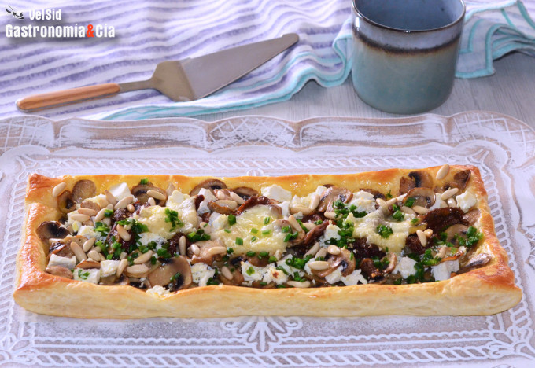

[title]: #()

## Tarta de hojaldre con champiñones, tomates secos y ricota salada, una receta fácil para celebrar 

[img]: #()

[#url]:#()

[recipe-time]: #()

PreviousDay: false

TotalTime: 

CookingTime: 

[ingredients-content]: #()

### Ingredientes (4 comensales)
*   500 gramos de champiñones
*   c/n de sal
*   c/n de pimienta negra recién molida
*   c/n de aceite de oliva virgen extra
*   1 masa de hojaldre fresco
*   1 huevo
*   16 tomates Corazón de buey secos en aceite ([El Rebost L'Antic Moli](https://www.anticmoli.com/es/categoria-producto/el-rebost/))
*   150 gramos de ricota salada
*   50 gramos de queso Tête de Moine
*   cebollino fresco.

[content]: #()

Hace unos días encontramos ricota salada en el supermercado, hacía bastante tiempo que no la comprábamos y nos encanta para hacer tartas de hojaldre, quiches, pizzas, tostadas… Hoy hemos hecho una tarta salada que es muy sencilla, pero estamos seguros de que os va a encantar como a nosotros en cuanto la probéis, ilustrando estas líneas podéis ver nuestra **Tarta de hojaldre con champiñones, tomates secos y ricota salada, una receta fácil para celebrar** que hoy es hoy (y esto sirve para el momento en el que lo estás leyendo).

Elegid un buen **hojaldre fresco**, puede ser redondo o rectangular, haceos con unos buenos **[champiñones de París](https://gastronomiaycia.republica.com/2012/11/25/champinon-de-paris/)**, de los que son macizos por dentro, no hace falta que sean muy grandes. Los **tomates secos en aceite de oliva virgen extra** aportan mucho sabor, y si son carnosos como los de [Corazón de buey](https://gastronomiaycia.republica.com/2009/08/29/tomate-corazon-de-buey/) mejor que mejor. La **ricota salada** la podéis encontrar en tiendas especializadas en queso (y en ocasiones, en semanas especiales de Lidl), pero si no la tenéis, podéis hacer esta tarta de hojaldre con un buen **queso fresco de oveja**, es la alternativa que solemos utilizar nosotros, también queda bien con queso feta.  

## Elaboración

Limpia los **champiñones** y córtalos en láminas, pon a calentar una sartén con un chorrito de aceite de oliva virgen extra y añade los champiñones, salpimenta al gusto y cocina las setas a fuego fuerte unos cinco minutos, **salteándolos** para que se hagan de forma homogénea.

Casi al final, añade los **tomates secos en aceite**, enteros o troceados, como prefieras. Opcionalmente también puedes añadir un diente de ajo picado para saltear los champiñones. Después, déjalos enfriar en un plato.

Enciende el **horno a 220º C** con calor arriba y abajo. Saca la masa de hojaldre fresco de la nevera y córtala en dos para hacer dos tartas alargadas (si prefieres hacer el hojaldre entero, puedes hacerlo). **Pincha la superficie de la masa** varias veces con un tenedor, sin llegar a los bordes para que suban durante el horneado.

Pinta el hojaldre con huevo batido y reparte los champiñones con tomates secos. Desmiga la [ricota salada](https://gastronomiaycia.republica.com/2008/09/01/requeson-y-ricotta/) y repártela también sobre el hojaldre. Dispón el queso Tête de Moine [en rosetas](https://gastronomiaycia.republica.com/2014/12/03/girolle-cortador-de-queso-tete-de-moine/) sobre la ricota y finalmente añade los piñones.

Introduce la bandeja en el horno a altura media, baja la temperatura a 200º C y hornea el hojaldre unos 12-15 minutos o hasta que la masa esté dorada por los bordes. Entonces, retira del horno y deja enfriar sobre una rejilla.

## Acabado y presentación

Presenta la **tarta de hojaldre con champiñones y ricota salada** en una bandeja, añade el cebollino fresco picado y córtala en porciones para repartir entre los comensales, la van a disfrutar. ¡Buen provecho!

_Abreviaturas_  
c/s = Cuchara sopera  
c/p = Cuchara de postre  
c/c = Cuchara de café  
c/n = Cantidad necesaria

