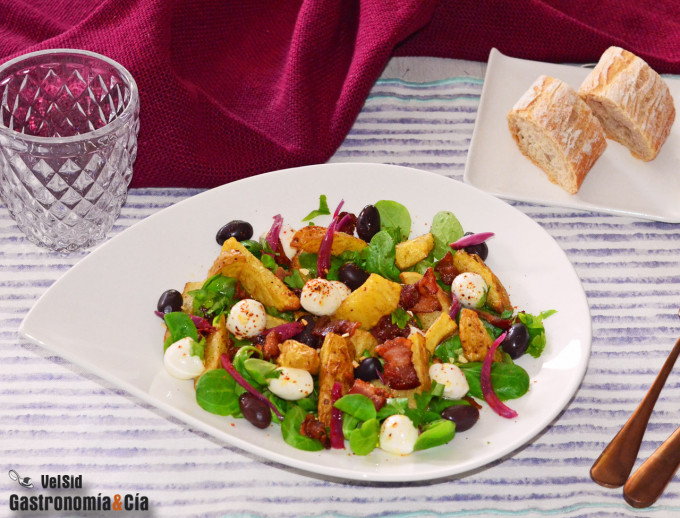

[title]: #()

## Ensalada de patata, bacon ahumado y mozzarella, la receta de verano que más te va a gustar 

[img]: #()

[#url]:#()

[recipe-time]: #()

PreviousDay: false

TotalTime: 

CookingTime: 

[ingredients-content]: #()

### Ingredientes (4 personas)
*   4 patatas medianas
*   ½ c/p de comino en polvo
*   8 lonchas de bacon ahumado
*   2-3 c/s de cebolla encurtida ([ver receta](https://gastronomiaycia.republica.com/2018/08/19/como-hacer-cebolla-encurtida-para-ensaladas-y-sandwiches/))
*   c/n de aceitunas negras de Aragón
*   ½ o 1 bolsa de canónigos
*   200 gramos de bolitas de mozzarella
*   especias Tajín (chile-limón)
*   ½ c/p de ajo granulado
*   1 c/p de perejil fresco picado
*   c/n de sal
*   c/n de aceite de oliva virgen extra.

[content]: #()

Si os apetece probar una **ensalada de patata** muy distinta a la tradicional, no os perdáis el que puede convertirse en vuestro plato estrella del verano, nuestra **Ensalada de patata, bacon ahumado y mozzarella**. Es una ensalada con patata y bacon crujiente y resulta mucho más ligera y muy sabrosa, no está cargada de mahonesa, simplemente se adereza con un poco de aceite de oliva virgen extra. También tiene parte de grasa del **bacon ahumado**, pero poca, porque lo cocinamos en la **freidora de aire** y la grasa que expulsa se filtra y elimina.

A su vez, aporta **su sabor y aroma a las patatas** mientras se va cocinando, no sabéis qué ricas quedan las patatas con bacon cocinadas en la _airfryer_, ideales para comerlas solas… Pero también para disfrutar de un plato más completo añadiendo vegetales. En este caso hemos utilizado canónigos, pero podéis sustituirlos por las hojas verdes que queráis, **lechuga**, rúcula, espinacas, endibias… Ya sabéis que tenéis que adaptar las recetas que os apetece probar a vuestros gustos y a lo que tenéis en vuestra cocina, y estamos seguros de que esta **ensalada de patata, bacon y mozzarella** os va a encantar.

## Elaboración

Lava muy bien las patatas para cocinarlas con su piel, **córtalas en gajos** del tamaño deseado, nuestras patatas eran alargadas, así que después de hacer los [clásicos gajos](https://gastronomiaycia.republica.com/2011/08/26/como-cortar-las-patatas-en-gajos/), los cortamos por la mitad. Lávalas y escúrrelas bien.

Pon las patatas en un bol y condimenta con sal, comino en polvo y una cucharada de aceite de oliva virgen extra, mezcla bien y pon las patatas en la cesta de la **freidora de aire** (también puedes hacerlas en el horno convencional, o puedes cocerlas en el microondas y dorarlas en una sartén, como en [esta receta de patatas gajo](https://gastronomiaycia.republica.com/2017/07/07/como-hacer-patatas-gajo-saludables-en-diez-minutos/)). Programa 12 minutos a 180º C.

Mientras tanto, corta las lonchas de bacon ahumado en tiras anchas, cuando haya finalizado la programación de las patatas, incorpora el bacon y programa unos 8 minutos o hasta que **las patatas y el bacon estén dorados y crujientes**. Reserva a temperatura ambiente.

Prepara la cebolla encurtida que vayas a incorporar a la ensalada de patata, escúrrela bien. Escurre también las aceitunas del [líquido de gobierno](https://gastronomiaycia.republica.com/2009/09/30/liquido-de-gobierno/), haz lo propio con las bolitas o perlas de mozzarella y prepara el resto de ingredientes, canónigos, especias…

## Acabado y presentación

Sirve en los platos una cama de **canónigos**, a continuación reparte las **patatas con bacon** templadas o frías, reparte también la cebolla encurtida, las aceitunas y la mozzarella. Condimenta con las especias Tajín, el ajo granulado y el perejil fresco picado (también puedes poner cebollino). Termina con un poco de sal (si consideras necesario) y un hilo de **aceite de oliva virgen extra**. ¡Buen provecho!

_Abreviaturas_  
c/s = Cuchara sopera  
c/p = Cuchara de postre  
c/c = Cuchara de café  
c/n = Cantidad necesaria

