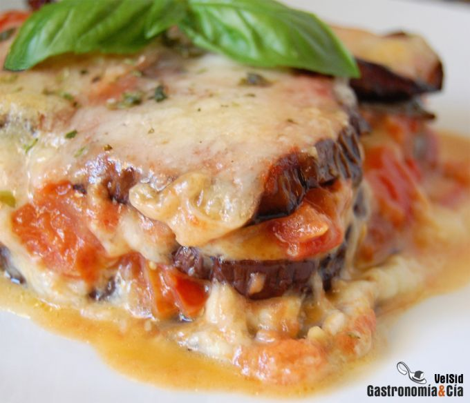

[title]: #()

## Melanzane alla parmigiana 

[img]: #()

[#url]:#()

[recipe-time]: #()

PreviousDay: false

TotalTime: 

CookingTime: 

[ingredients-content]: #()

### Ingredientes (4 comensales)
*   2 berenjenas medianas
*   6 tomates maduros pero firmes
*   2 bolas de mozzarella de búfala
*   100 gramos de queso parmesano
*   pimienta negra
*   albahaca fresca
*   orégano (opcional)
*   sal
*   aceite de oliva virgen extra.

[content]: #()

La **Melanzane alla parmigiana** es lo que nosotros conocemos como _Berenjenas a la parmesana_. Esta es una receta tradicional del sur de Italia de la que han surgido muchas variantes, pero básicamente los ingredientes son las berenjenas (melanzane), el queso parmesano, la mozzarella, la salsa de tomate y como hierba aromática, la [albahaca](https://gastronomiaycia.republica.com/2010/07/28/albahaca-ocimum-basilicum/).

La Melanzane alla parmigiana es un plato delicioso que conquista a todos los paladares, aunque no sean muy amantes de la berenjena. La elaboración, aunque sencilla, es un poco lenta, pues antes de introducir el plato montado en el horno, hay que hacer varios preparativos, pero merece la pena.  

Os mostramos nuestra **receta de Melanzane alla parmigiana** o _Berenjenas a la parmesana_, que nuestro paladar disfruta con poco tomate y mucho parmesano, vosotros adecuar la cantidad de ingredientes según vuestro gusto, lo importante, como siempre decimos, es que lo que cocinemos, nos deleite.

### Elaboración

Lava las berenjenas, despúntalas y córtalas en rodajas de medio centímetro de grosor. Puedes hacer las rodajas transversales o longitudinales, según el molde que vayas a utilizar, pues puedes preparar las berenjenas a la parmesana en moldes individuales o hacerla en una fuente amplia para después repartir.

La receta original de Melanzane alla parmigiana pide rebozar y freír la berenjena, pero aligeramos bastante más el plato haciéndola al horno o a la plancha. Si quieres hacerla al horno, después de cortar las rodajas de berenjena sálalas y disponlas en la bandeja del horno con unas gotas de aceite de oliva. Hornea a 180º C hasta que estén tiernas y ligeramente doradas.

Mientras se hacen las berenjenas puedes preparar los tomates. Lávalos, pélalos si quieres y trocéalos en daditos. Rehoga el tomate en una sartén con un poco de aceite de oliva, cinco o seis hojas de albahaca fresca, sal al gusto y una pizca de azúcar. Sofríe a fuego fuerte no más de diez minutos.

Ralla el parmesano y corta en finas lonchas la mozzarella y empieza a montar el plato, que viene a ser como una [lasaña](https://gastronomiaycia.republica.com/2009/09/18/lasana-de-espinacas-y-merluza/). Se empieza con una base de tomate, pero nosotros la obviamos porque como os hemos comentado, nos gusta con poco tomate. A continuación (o en principio) dispón una cama de rodajas de berenjena solapando unas con otras, espolvorea el parmesano recién rallado, cubre con unas lonchas de mozzarella y seguidamente una capa de tomate, vuelta a empezar con las berenjenas, el parmesano, la mozzarella y el tomate.

Entre capa y capa puedes poner también unas hojas de albahaca, y para culminar el plato termina con las rodajas de berenjena cubiertas de tomate y sobre este un poco de parmesano y mozzarella para gratinar.

Introduce en el horno precalentado a 180º C con el grill encendido durante media hora aproximadamente, cuando la superficie se haya dorado, puedes retirar la **Melanzane alla parmigiana** y servir espolvoreando un poco de orégano y decorando con unas hojas de albahaca fresca.

Os vais a chupar los dedos y los comensales van a disfrutar tanto que os felicitarán por vuestra labor en la cocina. Para los más carnívoros podéis incluir unas lonchas de jamón cocido o panceta, seguro que les encantará. ¡Buen provecho!

