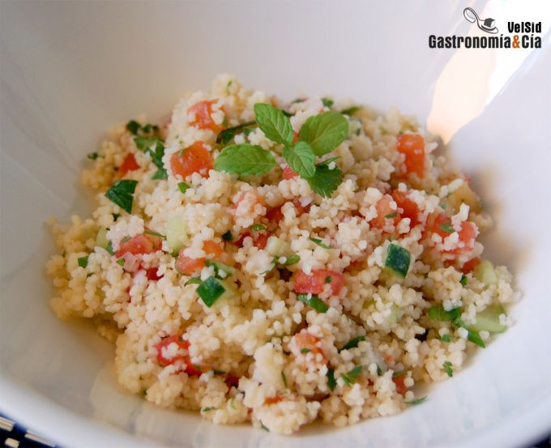

[title]: #()

## Tabulé 

[img]: #()

[#url]:#()

[recipe-time]: #()

PreviousDay: false

TotalTime: 

CookingTime: 

[ingredients-content]: #()

### Ingredientes (4 comensales)
*   250 gramos de cuscús precocido
*   ¼ litro de agua
*   1 pepino
*   3 tomates medianos
*   1 cebolla tierna
*   menta fresca
*   perejil fresco
*   cilantro fresco
*   1 limón
*   pimienta negra
*   aceite de oliva virgen extra
*   sal.

[content]: #()

El **Tabulé** (del árabe _tabbula_), que también podemos ver como **taboulé, tabouleh o tabbouleh**, es una ensalada de Oriente Medio ideal para los meses veraniegos, pues se toma fresquita y ofrece sabores que limpian el paladar.

La tradicional **receta de tabulé** se elabora con [bulgur](https://gastronomiaycia.republica.com/2008/04/20/trigo-bulgur/), el trigo partido del que os hemos hablado en [Gastronomía & Cía](https://gastronomiaycia.republica.com/), pero es muy común sustituirlo por cuscús, y a nosotros nos encanta así. El resto de ingredientes que componen la ensalada tabulé pueden variar de unas zonas a otras, así que lo mejor es que cada uno prepare el tabulé con los ingredientes que más le gusten y en las proporciones más satisfactorias para el paladar.

El **taboulé** que hoy hemos tomado como entrante de la comida es el que os mostramos en estas imágenes, lo más importante es conseguir que el grano del **cuscús** quede suelto y prepararlo con tiempo para que pueda permanecer en el frigorífico al menos un par de horas, para que esté bien fresquito y los sabores estén bien integrados.  

### Elaboración

Pon el agua a calentar con un poco de sal y coloca el cuscús en una fuente o bandeja donde puedas extenderlo. Cuando el agua entre en ebullición, viértela sobre el cuscús y no dejes de remover con un tenedor metálico para que el grano quede bien suelto, puedes añadir un poco de aceite de oliva o mantequilla. Deja enfriar moviendo de vez en cuando.

También existe la opción de cocer el cuscús con el zumo de limón, necesitarás más unidades de este cítrico y su sabor será más pronunciado, pero es así de sencillo, verter zumo de limón sobre el cuscús, mover bien y dejar en reposo hasta que el grano este blando.

Pela los tomates, retira las pepitas y córtalos en daditos, lava el pepino y córtalo en daditos como los tomates (puedes pelar el pepino o no, recuerda que en la piel están todos los nutrientes), haz lo mismo con la cebolla tierna, pélala y pícala bien. Mezcla en un cuenco estos tres ingredientes y riégalos con el zumo del limón.

Pica a continuación las hierbas aromáticas, deben salir aproximadamente dos cucharadas soperas de perejil, dos de menta y dos de [cilantro](https://gastronomiaycia.republica.com/2008/07/08/cilantro-o-coriandro/), pero si te gusta alguna más que otra, puedes poner más cantidad para que predomine el sabor. Incluso puedes añadir albahaca si lo deseas.

Incorpora las hierbas aromáticas al cuenco de los vegetales, salpimenta y añade aceite de oliva virgen extra, mezcla bien y vierte sobre el cuscús para volver a mezclar y reservar en el frigorífico.

### Emplatado

El **tabulé o taboulé** se puede servir en cuencos, en platos llanos e incluso en vasos, que ahora está muy de moda. Puedes también utilizar un aro de emplatar para darle forma y coronar con unos brotes de alfalfa o unas hojitas de menta.

Lo que es seguro, es que refrescará el paladar de quien lo deguste, resultando además un entrante muy nutritivo y ligero.
