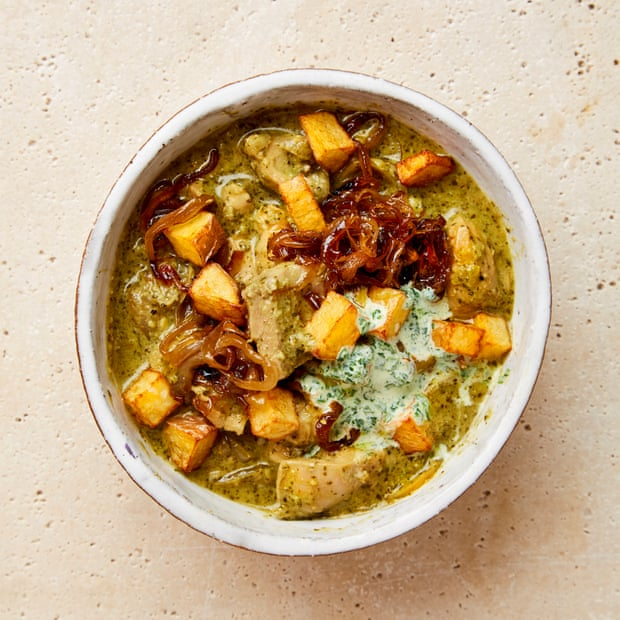

[title]: #()

## Kalia Poule

[img]: #()

[#url]:#()

[recipe-time]: #()

PreviousDay: false

TotalTime: 1h 30 min

CookingTime: 

[ingredients-content]: #()

### Serves 4
* 40g piece fresh ginger, skin and all
* 40g garlic (about 12 cloves), peeled
* 30g mint leaves
* 8 tbsp (30g) fresh coriander, roughly chopped
* 2 large green chillies, stems removed
* 150g Greek-style yoghurt
* 2-3 lemons – 1 finely zested, to get 2 tsp, and all 3 juiced, to get 75ml juice (1 tbsp to use in the yoghurt)
* 2 tbsp ground cumin
* 1 tbsp ground coriander
* 1 tsp freshly ground black pepper
* Salt
* 7 cardamom pods
* 9 cloves
* 2 cinnamon sticks
* 500g skinless and boneless chicken thighs, cut into 3cm cubes
* 60ml olive oil
* 500g onions (about 3 medium ones), peeled and thinly sliced
* 1 tbsp dark brown sugar

* 500ml sunflower oil
* 500g red potatoes (or any other non-waxy variety), cut into 1½cm cubes

For the mint yoghurt
* 30g mint leaves
* 150g Greek-style yoghurt

[content]: #()

In a food processor, blitz the ginger, garlic, mint, coriander, chillies, yoghurt, lemon zest and four tablespoons of the lemon juice until smooth. Add the ground cumin, ground coriander and black pepper, half a tablespoon of salt and 300ml water, and mix well. Stir in the cardamom pods, cloves and cinnamon, then scrape out into a medium bowl. Add the chicken to the bowl, toss to coat and leave to marinate at room temperature for at least 30 minutes (or refrigerate and marinate overnight).

Meanwhile, set a large saucepan for which you have a lid on a medium heat, add the oil and, once hot, add the onions, sugar and half a teaspoon of salt, and fry for 15 minutes, until golden brown. Transfer half the onion mix to a small bowl and set aside.

Put the chicken and its marinade in the pan with the remaining onions, cover the pot and leave to cook for 20 minutes, stirring once or twice to prevent sticking.

Meanwhile, make the mint yoghurt. Blitz the mint, yoghurt, the remaining tablespoon of lemon juice and a teaspoon of salt until smooth, then scrape out into a small bowl and set aside.

In a large saucepan, heat the sunflower oil on a medium heat and, once hot, fry the potatoes, turning regularly, for 15 minutes, or until golden brown. Use a slotted spoon to transfer the cooked potatoes to a large plate lined with kitchen paper, to drain, season with a teaspoon of salt and set aside.

Divide the chicken mixture between four bowls, top with the onions and fried potatoes, finish with a spoonful of mint yoghurt and serve.