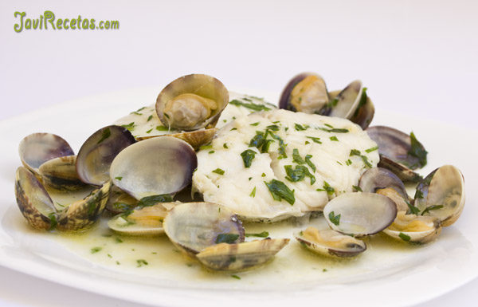

[title]: #()

## Merluza Salsa Verde

[img]: #()

[#url]:#()

[recipe-time]: #()

PreviousDay: false

TotalTime: 3 horas (preparar almejas)

CookingTime: 40 min

[ingredients-content]: #()

### Ingredientes para hacer Merluza en Salsa Verde (para 2 personas):

* 4 rodajas de merluza (de unos dos dedos de grosor cada una)
* 250 gramos de almejas (si son grandecitas mejor)
* 125 ml de caldo de pescado
* 2 cucharadas de vino blanco (yo usé manzanilla La Gitana)
* 4 dientes de ajo
* 3 cucharadas con perejil picado
* 1 cucharada de harina
* 4 cucharadas de aceite de oliva
* sal

[content]: #()

Lo primero de todo es preparar las almejas para que suelten toda la arena. Tienes que dejarlas en remojo con sal 1 hora y cambiarles el agua un par de veces (total 2 horas). Si vas mal de tiempo déjalas en remojo mientras preparas la receta y sácalas del agua justo antes de añadir al la cazuela pero te arriesgas a tragar un poco de arena.

Pela los dientes de ajo y pícalos muy finos. Coge una cazuela ancha (lo suficiente para meter las cuatro rodajas de merluza y las almejas), echa el aceite y pon a calentar. Luego añade los ajos y vigila que no se quemen.

Cuando los ajos lleven un par de segundos bailando en el aceite (saltando con el chisporroteo) echa la cuchara de harina y cocínala durante medio minuto.

A continuación añade el vino y luego el caldo de pescado (si está caliente mejor). Si el caldo de pescado no lleva sal añade una pizca y prueba de sal, pero ten en cuenta que las almejas y el pescado soltarán algo de sal. Así que ve con cuidado.

Sala las rodajas de merluzas por ambos lados y cuando el caldo esté bien caliente añade el perejil picado y las rodajas a la cazuela. Deja 3 minutos por una de las caras meneando la cazuela suavemente para que la salsa vaya ligando (como en el bacalao al Pil Pil).

Pasados los tres minutos dale la vuelta a las rodajas de merluza y añade las almejas. Sigue meneando la cazuela para que la salsa siga ligando A medida que se vayan abriendo las almejas puedes ir retirándolas con una pinzas a un plato y así evitarás que cojan una consistencia gomosa (muy dura, como caucho). Cuando las tengas todas abiertas devuelvelas a la cazuela para que tomen algo de calor y si han pasado tres minutos desde que le diste la vuelta a las rodajas de merluza el plato está listo para servir.

Reparte dos rodajas en cada plato y rodea con las almejas. Después baña con la salsa verde el pescado y el marisco (yo en la foto añadí poco caldo pero en la mesa le puse cantidad). Fuera de la cocina y a comer!!!

**A comer:**

Hoy poco más que añadir, excepto que esta salsa invita a mojar pan así que no olvidéis comprar una buena barra. Por cierto, si os apetece otra receta de merluza algo distinta (con una salsa casi verde pero con almendras) te invito a que pruebes esta Merluza en Salsa.

Espero que les guste esta receta de pescado y que disfruten en la mesa con este plato. Pronto tendremos más recetas de cocina. Un saludo cocineras y cocineros.