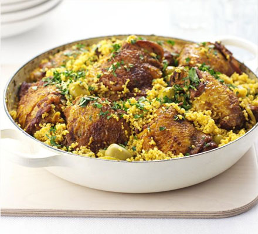

[title]: #()

## Chicken & couscous one-pot

[img]: #()

[url]: #()

https://www.bbcgoodfoodme.com/recipes/chicken-and-couscous-onepot/

[recipe-time]: #()

PreviousDay: false

TotalTime: 1h 10 min

CookingTime: 1h

[ingredients-content]: #()

### Ingredients (4 people)

* 8 skin-on, bone-in chicken thighs
* 2 tsp turmeric
* 1 tbsp garam masala
* 2 tbsp sunflower oil
* 2 onions, finely sliced
* 3 garlic cloves, sliced
* 500ml chicken stock
* Large handful whole green olives
* Zest and juice of 1 lemon
* 250g couscous
* Small bunch flat-leaf parsley, chopped

[content]: #()

A delicious one-pot chicken and couscous dish by chef Barney Desmazery, featuring aromatic spices and tender chicken thighs served on a bed of fluffy couscous with olives and lemon.

1. Coat chicken thighs with half the spices and salt. Heat 1 tbsp oil in a large sauté pan with lid. Fry chicken skin-side down for 10 minutes until golden, flip, cook 2 minutes more, then remove.

2. Add remaining oil to pan, fry onions and garlic for 8 minutes until golden. Stir in remaining spices, cook 1 minute.

3. Pour in stock, scatter olives, bring to boil. Place chicken skin-side up in stock. Cover and simmer gently 35-40 minutes until chicken is tender.

4. Boil kettle, remove chicken to plate. Off heat, stir lemon juice and couscous into onion mixture. Add boiling water to just cover couscous if needed. Cover, rest 5 minutes until cooked.

5. Fluff couscous with half the parsley and lemon zest, top with chicken. Scatter remaining parsley and zest before serving.
