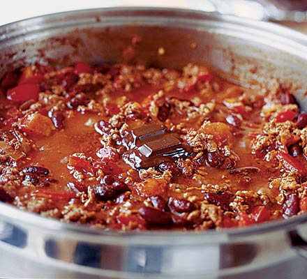

[title]: #()

## Chilli con carne

[img]: #()

[url]: #()

https://www.bbcgoodfoodme.com/recipes/chilli-con-carne/

[recipe-time]: #()

PreviousDay: false

TotalTime: 1h 10 min

CookingTime: 1h

[ingredients-content]: #()

### Ingredients (4 people)

* 1 tbsp oil
* 1 large onion
* 1 red pepper
* 2 garlic cloves, peeled
* 1 heaped tsp hot chilli powder (or 1 level tbsp mild)
* 1 tsp paprika
* 1 tsp ground cumin
* 500g lean minced beef
* 1 beef stock cube
* 400g can chopped tomatoes
* ½ tsp dried marjoram
* 1 tsp sugar
* 2 tbsp tomato purée
* 410g can red kidney beans
* Plain boiled long grain rice, to serve
* Soured cream, to serve

[content]: #()

A classic chilli con carne recipe - one of the best dishes to serve to friends for a casual get-together. An easy sharing favourite that uses up storecupboard ingredients.

1. Dice the onion into 5mm squares, chop the red pepper, and finely mince the garlic cloves.

2. Heat oil over medium heat for 1-2 minutes. Add onions and cook 5 minutes until soft. Add garlic, pepper, chilli powder, paprika, and cumin. Cook 5 more minutes.

3. Increase heat, add 500g minced beef. Break apart and stir for 5+ minutes until uniformly browned with no pink remaining.

4. Dissolve beef stock cube in 300ml hot water. Add to pan with canned tomatoes, marjoram, sugar, and tomato purée. Stir well and season.

5. Bring to boil, cover, reduce heat to gentle bubble for 20 minutes. Stir occasionally; add water if needed.

6. Drain and rinse canned kidney beans. Stir into chilli. Return to boil, simmer uncovered 10 minutes. Taste and season generously.

7. Cover, turn off heat, let stand 10 minutes. Serve with soured cream and rice.
