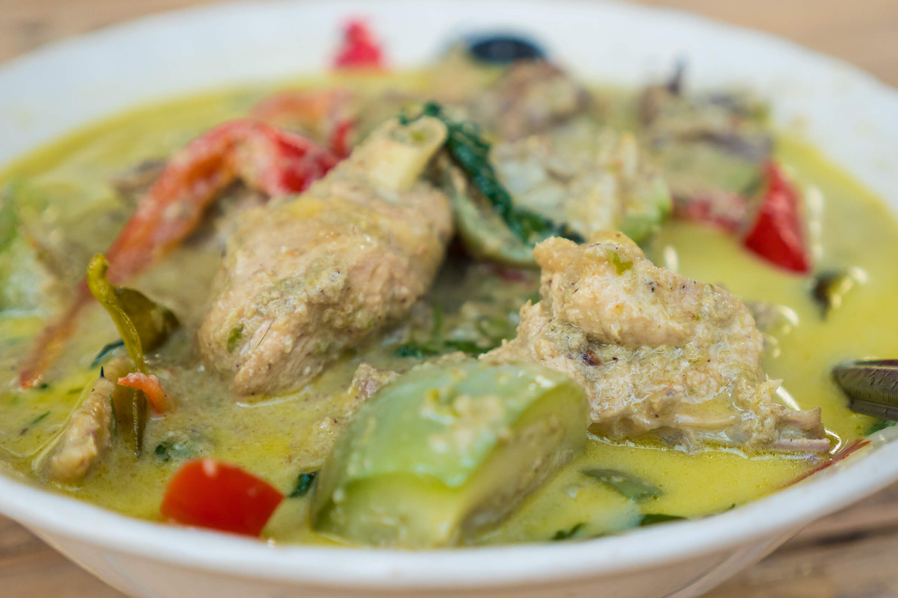

[title]: #()

## Authentic Thai Green Curry Recipe (แกงเขียวหวาน)

[img]: #()

[url]: #()

https://www.eatingthaifood.com/thai-green-curry-recipe/

[recipe-time]: #()

PreviousDay: false

TotalTime: 2h 30 min

CookingTime: 30 min

[ingredients-content]: #()

### Ingredients (3-4 people)

**For the curry:**
* 1 whole chicken (1.4 kg free range)
* 2 cups water
* Green curry paste (see below)
* 2-3 cups coconut cream
* 6-10 Thai eggplant
* 6-10 stems Thai sweet basil
* 2 red spur chilies
* 20 kaffir lime leaves
* ½ tsp salt (or to taste)

**For the green curry paste:**
* 150 grams Thai green chilies
* 1 head garlic
* 3 small shallots
* 1 thumb-sized piece galangal
* 5 cilantro roots
* 1 kaffir lime peel
* 2 stalks lemongrass
* 1 tbsp white peppercorns
* 1 tsp coriander seed
* 1 tsp cumin seed
* 1 tsp salt
* 1 tbsp shrimp paste

[content]: #()

This homemade green curry starts from scratch by pounding Thai green curry paste, then combining it with chopped chicken and rich coconut cream for authentic Central Thai flavors.

1. Prepare your ingredients to pound your green curry paste. Remove the stems of the Thai green chilies, peel the garlic and shallots, thinly slice the galangal, cilantro roots, and lemongrass.

2. Pound all the green curry paste ingredients in a stone mortar and pestle, apart from the shrimp paste, which you'll add at the very end. This will take 1-2 hours until you get a smooth pureed consistency.

3. Once your paste is finished, add the shrimp paste, and mix and mash until it's evenly mixed in.

4. Prepare your whole chicken by gutting and cleaning it. Chop the entire chicken into bite sized pieces.

5. In a pot, add 2 cups of water, the green curry paste, your pieces of chicken, and toss in about 10 kaffir lime leaves (broken in half).

6. Boil the chicken for about 10 minutes, or until the chicken is tender and most of the water has evaporated.

7. While the chicken cooks, quarter the Thai eggplant, pluck the basil leaves from the stems, and julienne the red spur chilies.

8. Add the coconut cream to the pot, bring to a boil with gentle stirring. Taste and add salt (approximately ½ tsp).

9. Add the eggplant and spur chilies, boil for 2-3 minutes.

10. Add the Thai sweet basil, turn off the heat, and let it wilt into the curry.
