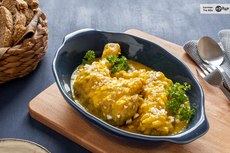

[title]: #()

## Gallina en pepitoria

[img]: #()

[url]: #()

https://web.archive.org/web/20260208022928/https://raizdeguzman.com/gallina-pepitoria-receta-sorprender-dia-madre/

[recipe-time]: #()

PreviousDay: false

TotalTime: 2h 20 min

CookingTime: 2h

[ingredients-content]: #()

### Ingredientes (4 personas)

* 1 gallina o 1 pollo de 1 kilogramo
* 2 cebollas
* 2 huevos
* 2 dientes de ajo
* Almendras tostadas
* Azafrán
* Vino blanco
* Una cucharada de harina
* Aceite de oliva virgen extra
* Sal
* Pimienta

[content]: #()

Las carnes blancas destacan por su versatilidad en cuestiones gastronómicas, ya que admiten todo tipo de combinaciones e ingredientes dispares.

**Elaboración de la gallina en pepitoria**

Lo primero que hay que hacer es limpiar bien la gallina o pollo. Ello conlleva eliminar los restos de plumas y demás impurezas y lavar con abundante agua caliente.

En caso de que la carne no esté partida, utilizar un cuchillo para trocear la carne en octavas y acto seguido, salpimentar al gusto del comensal. Reservar para más adelante.

Mientras tanto, poner a cocer en una cazuela los huevos durante unos 10 minutos. Transcurrido ese tiempo, escurrir el agua, pelar los huevos y reservar las yemas para más adelante.

Para continuar, en una tabla de cocina, hay que pelar las cebollas y los ajos. Después, calentar aceite en una cazuela y freír hasta que estén dorados. Por otro lado, calentar aceite en una sartén y freír la carne.

Cuando esté lo suficientemente dorada, comienza la elaboración del guiso. Para ello, añadir la carne a la cazuela junto con las hojas de laurel, la harina (para que la mezcla espese) y el vino blanco. Es importante remover bien para que no queden grumos.

Si usas una cazuela, debes dejar que se cocine a fuego lento durante 2 horas aproximadamente. Si, por el contrario, optas por una olla exprés, en media hora estará listo el guiso.

En este periodo, servirse de un mortero para hacer un majado con las almendras tostadas, las yemas de huevo y el azafrán. A esta mezcla debes añadirle un poco del caldo del pollo para que se cree una pasta homogénea.

Después, incluir esta pasta a la cazuela y dejar cocer unos 10 minutos más. A la hora de servir, utilizar una cazuela de barro y coronar el plato con trocitos de la clara de huevo sobrante.
