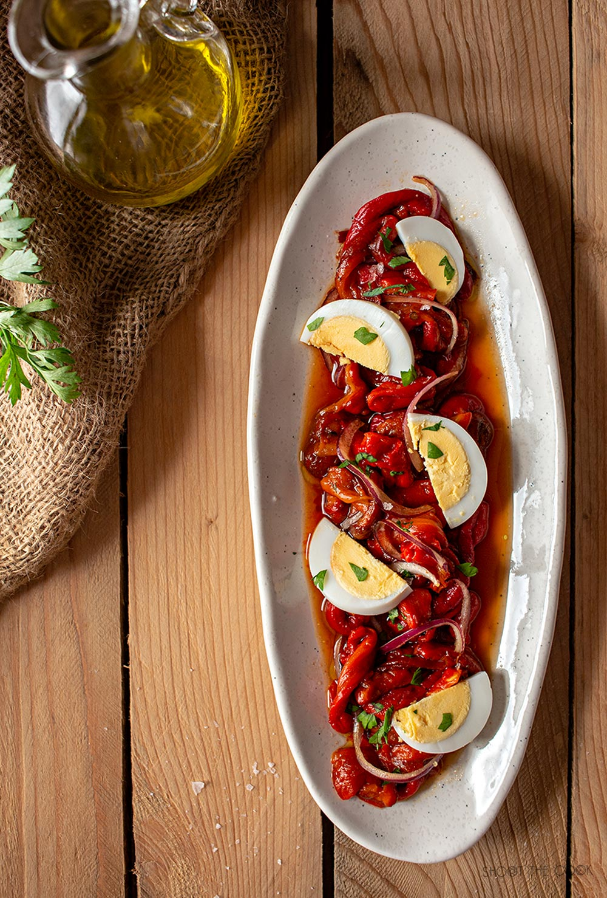

[title]: #()

## Ensalada de pimientos asados

[img]: #()

[url]: #()

https://www.shoothecook.es/ensalada-de-pimientos-asados/

[recipe-time]: #()

PreviousDay: false

TotalTime: 1h

CookingTime: 1h

[ingredients-content]: #()

### Ingredientes

* 4 pimientos rojos grandes para asar o bote de pimientos asados
* 1 huevo duro
* 1/4 de cebolla morada
* 3-4 Cdas. de aceite de oliva virgen extra
* 2 Cdas. de caldo de asar los pimientos
* sal, al gusto

[content]: #()

¿Cuáles es el mejor producto de tu tierra? En mi pueblo, sin duda alguna, el producto más aclamado son los pimientos asados a leña. Una auténtica delicatessen que se produce con mucho mimo.

Todavía varias empresas familiares siguen cultivando y asando los pimientos de forma tradicional, de ahí que sean tan exquisitos. Se merecen sin duda un pequeño homenaje y he querido hacerlo en forma de receta para que también vosotros os animéis a probarlos. Os voy a enseñar como hago la clásica ensalada de pimientos asados. Es un plato súper sencillo y con muy pocos ingredientes pero no necesitamos anda más cuando tenemos un producto tan bueno.

Aunque es una ensalada muy clásica seguro que muchos todavía no la habéis preparado, pues pronto os daréis cuenta de lo especial que es esta ensalada de pimientos asados.

**Elaboración paso a paso:**

1. Lava los pimientos y los secamos. Añade un poco de sal, un chorro de aceite de oliva por encima y metemos al horno con calor arriba y abajo a unos 200 ºC durante 45-60' según su tamaño y grosor.

2. Saca los pimientos del horno y cúbrelos con film o mételos en una bolsa de plástico cerrada para que suden y sean más fácil de pelar después.

3. Cuando se hayan templado pelarlos y despepitarlos. Guarda en un bol el jugo que suelten los pimientos. Córtalos en tiras longitudinalmente y los ponemos en un bol. Pica la cebolla en juliana fina y la echamos al bol. Añade 3-4 Cdas. de aceite de oliva, 2 Cdas. del jugo que has reservado y sal al gusto. Mezcla bien todo para que se ligue la salsa y que los pimientos se impregnen bien.

4. Sirve en una bandeja, añadimos el huevo cocido cortado en rodajas, un poco de perejil picado y un poco de sal Maldon. ¡Disfrútalo!
