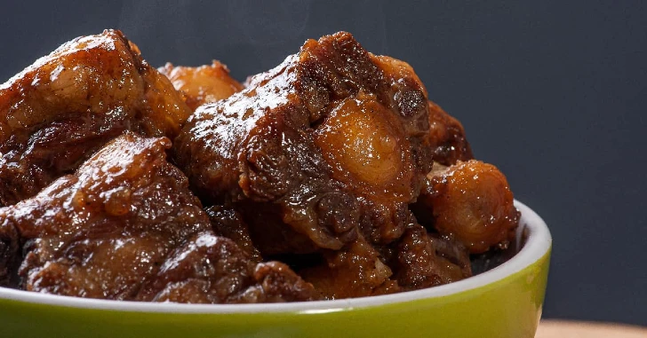

[title]: #()

## Rabo de toro al estilo cordobés

[img]: #()

[url]: #()

https://carniceriavictorsalvo.com/recetas/receta-rabo-de-toro/

[recipe-time]: #()

PreviousDay: false

TotalTime: 4h 10 min

CookingTime: 4h 10 min

[ingredients-content]: #()

### Ingredientes

* 1,5 kg de rabo de toro o vaca
* Harina
* Sal
* Aceite de oliva virgen extra
* 3 patatas
* 2 cebollas
* 3 zanahorias
* 2 pimientos verdes
* 1 puerro
* 6 ajos
* 1 vaso de vino de jerez
* ½ litro de caldo de carne
* Tomate triturado
* Pimienta
* Perejil
* Laurel

[content]: #()

El rabo de toro es un guiso tradicional cordobés originario de la provincia de Córdoba. Este plato combina melosidad y untuosidad con una rica salsa. Es una receta que requiere tiempo pero merecerá totalmente la pena cocinar.

**Elaboración:**

1. Aderezar la carne con sal y pimienta, enharinarla y dorarla en aceite caliente por todas sus caras.

2. Retirar la carne y secar en papel de cocina.

3. Picar todas las verduras y rehogar cebolla con ajos en el mismo aceite.

4. Añadir zanahorias, puerro y pimiento; luego incorporar tomate triturado.

5. Reintroducir la carne dorada en la olla con las verduras.

6. Añadir vino de jerez y caldo de carne cubriendo completamente los ingredientes; incorporar laurel, perejil y pimienta.

7. Cocinar 10 minutos a fuego alto, luego 4 horas a fuego bajo.

8. Retirar carne y verduras; triturar la salsa resultante.

9. Servir la carne bañada en la salsa triturada.

Se recomienda acompañar con patatas fritas.
