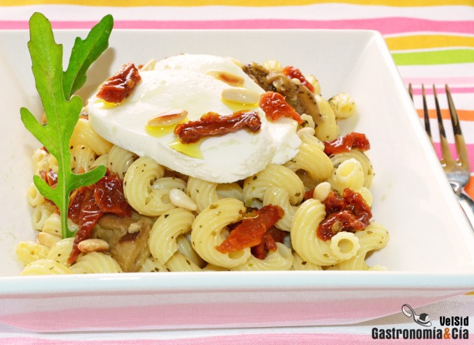

[title]: #()

## Ensalada de pasta con berenjena asada y mozzarella

[url]: # ()

http://www.gastronomiaycia.com/2014/05/27/ensalada-de-pasta-con-berenjena-asada-y-mozzarella/

[img]: #()

[recipe-time]: #()

PreviousDay: false

TotalTime: 20 min

CookingTime: 20 min

[ingredients-content]: #()

#### Ingredientes (4 comensales)

* 350 gramos de pasta corta y gruesa
* 2 berenjenas asadas
* 2 bolas de mozzarella fresca
* sal.

Para la vinagreta

* 12 [tomates secos en aceite de oliva](http://www.gastronomiaycia.com/2010/12/20/tomates-secos-en-aceite/)
* 2 c/s de piñones
* c/n de aceite de oliva virgen extra
* c/n de vinagre de manzana (o al gusto)
* 1 c/s de orégano
* pimienta negra recién molida
* sal.

[content]: #()

Hoy es un buen día para preparar esta *Ensalada de pasta con berenjena
asada y mozzarella*, también lo será mañana o cualquier otro día. Se trata
de una receta fácil y rápida de hacer, claro, si tienes la berenjena asada
previamente. En muchas ocasiones os hemos recomendado que aprovechéis
cuando encendéis el horno para hacer algo más, en casa lo que hacemos a
menudo es asar berenjenas y pimientos para hacer escalibada o para darle
cualquier otra salida.

Hay que comer verduras a diario y resulta muy fácil incorporarla en la
dieta como alimento principal o como acompañamiento, como en esta
receta de *Amorelli
<http://www.gastronomiaycia.com/2012/05/09/cavatappi/> con berenjena asada
y mozzarella* fresca, aderezada con una vinagreta de tomate seco y piñones.
Es un plato fresco, ideal para estos meses de calor que se avecinan, además
resulta sabrosa y nutritiva, ¿tomáis nota?

## Elaboración

Pon una olla con abundante agua a calentar, cuando rompa a hervir añade la
sal, verás como empieza a burbujear con más fuerza. Incorpora la pasta,
dale vueltas para que no se pegue, baja el fuego y cuece hasta que la pasta
esté al dente. En ese momento la puedes refrescar con agua para cortar la
cocción y para que esté fría para la ensalada.

Corta la berenjena asada, una vez pelada, en trozos irregulares. Corta las
bolas de mozzarella en rodajas para repartirlas antes de servir la ensalada
de pasta.

Prepara la vinagreta, trocea los tomates secos no muy pequeños y ponlos en
un bol. En una sartén sin engrasar, tuesta los piñones a fuego moderado,
cuando empiecen a dorarse, retíralos y viértelos al bol de los tomates.

Añade la cantidad necesaria de aceite de oliva virgen extra para aderezar
todos los platos de pasta, añade vinagre al gusto, el orégano, la pimienta
y la sal. Mezcla bien y prueba para rectificar.
Emplatado

Sirve en los platos la *ensalada de pasta* acompañada de la *berenjena
asada*, coronada con las rodajas de *mozzarella
<http://www.gastronomiaycia.com/2012/08/21/recetas-frias-mozzarella/>* y
aderezada con la vinagreta de tomates secos y piñones. Puedes aportar un
toque verde al plato con unas hojas de rúcula. ¡Buen provecho!
